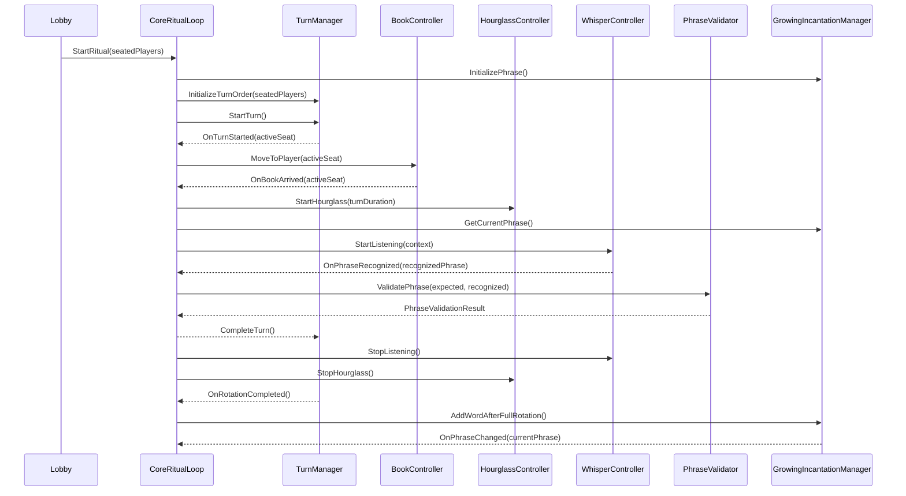

# Core Ritual Loop Architecture

## Purpose

This document defines the future Core Ritual Loop architecture for Incantation.

It is a design reference only. It does not authorize gameplay changes, scene changes, networking changes, visual changes, or implementation work by itself.

The goal is to remove ambiguity before replacing the current prototype ritual flow with smaller focused systems.

## Design Pillars

- The book is the main character of the ritual.
- The hourglass is the pressure system.
- Voice interaction is central.
- Players remain seated for the full ritual.
- One real cursed book moves between seated players.
- The shared ritual phrase grows by one word after a full table rotation, not after every individual turn.
- Whisper is the primary recognition path.
- Windows speech recognition is fallback only.
- The ritual word vocabulary stays separate from `SpellPhraseLibrary`.

## Complete Gameplay Flow

1. Player joins lobby.
2. Player is assigned to a seat automatically when the ritual setup begins.
3. Player readies.
4. Game starts when the lobby/ready rules allow it.
5. `CoreRitualLoop` initializes ritual state.
6. `TurnManager` selects the first seated active player.
7. `BookController` moves the one real book to that player's seat.
8. `BookController` raises `OnBookArrived`.
9. `CoreRitualLoop` starts the hourglass.
10. `CoreRitualLoop` requests the current shared phrase from `GrowingIncantationManager`.
11. `WhisperController` begins listening.
12. The active player speaks the full visible phrase.
13. `WhisperController` raises `OnPhraseRecognized` with the recognized text candidate.
14. `PhraseValidator` compares the recognized phrase against the full current phrase.
15. `CoreRitualLoop` receives the validation result.
16. On success, the turn succeeds.
17. `CoreRitualLoop` stops listening and stops the hourglass.
18. `TurnManager` completes the active turn and advances to the next seated active player.
19. If the completed turn ended a full table rotation, `TurnManager` raises `OnRotationCompleted`.
20. `GrowingIncantationManager` adds one word to the shared phrase.
21. The book moves to the next player.
22. The loop repeats until timeout, failure, elimination, or future game mode rules end the ritual.

## System Ownership

### CoreRitualLoop

#### Responsibility

`CoreRitualLoop` is the top-level ritual orchestrator.

It coordinates the ritual state machine and connects focused systems together. It decides when a ritual starts, when a turn starts, when listening starts, when validation occurs, when a turn succeeds or fails, and when the loop advances.

It does not own the rules inside those systems.

#### Public API

Future API:

- `StartRitual(IReadOnlyList<Seat> seatedPlayers)`
- `StopRitual()`
- `PauseRitual()`
- `ResumeRitual()`
- `HandlePhraseRecognized(string recognizedPhrase)`
- `HandleHourglassFinished()`
- `HandleBookArrived(Seat seat)`
- `HandleTurnSucceeded()`
- `HandleTurnFailed(RitualFailureReason reason)`

The exact method signatures may change during implementation, but the ownership should not: public methods should express ritual phase commands and event handlers, not low-level voice, seat, or book logic.

#### Events

- `OnRitualStarted`
- `OnRitualStopped`
- `OnRitualPaused`
- `OnRitualResumed`
- `OnTurnStarted`
- `OnTurnSucceeded`
- `OnTurnFailed`
- `OnRitualFailed`
- `OnRitualCompleted`

#### Dependencies

- `TurnManager`
- `GrowingIncantationManager`
- `PhraseValidator`
- `WhisperController`
- `BookController` or the current book movement adapter
- `HourglassController`
- Future lobby/ready/seating entry point

#### Does NOT know about

- Notebook
- Cards
- Lore delivery
- Demon reactions
- Voice chat
- Steam
- Spell system
- `SpellPhraseLibrary`
- Network transport details
- Book mesh, animation internals, or visual-only `BookGhost`
- Microphone implementation details
- Individual word alias learning

### TurnManager

#### Responsibility

`TurnManager` owns seated ritual turn order.

It tracks the active player index, advances between seated active players, skips eliminated players when elimination exists, and detects when every active seated player has completed one turn in the current rotation.

It does not move the book, start the hourglass, listen to the microphone, or validate speech.

#### Public API

Future API:

- `InitializeTurnOrder(IReadOnlyList<Seat> seatedPlayers)`
- `ResetTurnOrder()`
- `Seat GetCurrentSeat()`
- `Seat GetNextSeat()`
- `void StartTurn()`
- `TurnAdvanceResult CompleteTurn()`
- `void MarkSeatEliminated(Seat seat)`
- `bool HasCompletedFullRotation()`
- `int ActivePlayerCount { get; }`
- `int CurrentPlayerIndex { get; }`
- `int TurnsCompletedThisRotation { get; }`

#### Events

- `OnTurnOrderInitialized`
- `OnTurnStarted`
- `OnTurnCompleted`
- `OnActivePlayerChanged`
- `OnRotationCompleted`
- `OnPlayerSkipped`
- `OnPlayerEliminated`

#### Dependencies

- Seated player list from the lobby/seating setup.
- `Seat` data.
- Future elimination state.

#### Does NOT know about

- Book movement.
- Hourglass timing.
- Whisper.
- Phrase text.
- Phrase validation.
- UI.
- Demon reactions.
- Cards or interference.
- Networking implementation details.

### GrowingIncantationManager

#### Responsibility

`GrowingIncantationManager` owns the shared ritual phrase.

It initializes the phrase with one ritual word, exposes the current full phrase, and appends one new ritual word after each complete table rotation.

It owns phrase growth difficulty but not turn order or voice recognition.

#### Public API

Future API:

- `ResetPhrase()`
- `InitializePhrase()`
- `AddWordAfterFullRotation()`
- `string GetCurrentPhrase()`
- `IReadOnlyList<IncantationWord> GetCurrentWords()`
- `void SetDifficulty(int difficulty)`
- `int CurrentDifficulty { get; }`
- `int CurrentWordCount { get; }`
- `string CurrentPhrase { get; }`

#### Events

- `OnPhraseInitialized`
- `OnPhraseChanged`
- `OnWordAdded`
- `OnDifficultyChanged`

#### Dependencies

- `IncantationWordLibrary`
- `IncantationWord`
- Future difficulty settings.

#### Does NOT know about

- Which player is active.
- Book movement.
- Hourglass timing.
- Whisper.
- Windows speech fallback.
- Phrase recognition events.
- Spell/card phrases.
- `SpellPhraseLibrary`.
- UI display implementation.
- Demon reactions.

### PhraseValidator

#### Responsibility

`PhraseValidator` compares recognized speech against the current full visible ritual phrase.

The default ritual success rule is full phrase matching after normalization. It may use ritual word aliases through a ritual-specific normalizer, but it must not use spell/card phrase libraries.

#### Public API

Current API:

- `static string NormalizePhrase(string phrase)`
- `static bool Validate(string expectedPhrase, string recognizedPhrase)`
- `bool ValidatePhrase(string expectedPhrase, string recognizedPhrase)`

Future API:

- `PhraseValidationResult ValidatePhrase(PhraseValidationRequest request)`
- `string NormalizePhrase(string phrase)`

#### Events

`PhraseValidator` should usually be pure and eventless. If event hooks are needed for debug or telemetry, they should be optional and non-authoritative:

- `OnPhraseValidated`

#### Dependencies

- Optional ritual phrase normalizer.
- Optional ritual word alias source from `IncantationWordLibrary`.

#### Does NOT know about

- Turn order.
- Book movement.
- Hourglass state.
- Microphone state.
- Whisper internals.
- Windows recognizer internals.
- Player elimination.
- UI.
- Spell/card phrases.
- `SpellPhraseLibrary`.

### WhisperController

#### Responsibility

`WhisperController` coordinates ritual listening sessions for the primary Whisper path.

It is a wrapper around the recognizer flow, not the recognizer implementation itself. It starts listening when a turn is ready for speech, stops listening when the turn ends, cancels listening when the ritual aborts, and forwards phrase candidates to the ritual loop.

Windows speech recognition remains a fallback path and should not be designed as the primary ritual path.

#### Public API

Current API:

- `StartListening()`
- `StopListening()`
- `CancelListening()`
- `bool IsListening { get; }`

Future API:

- `StartListening(RitualListeningContext context)`
- `StopListening()`
- `CancelListening()`
- `bool IsListening { get; }`
- `bool IsProcessingRecognition { get; }`

#### Events

- `OnListeningStarted`
- `OnListeningStopped`
- `OnListeningCanceled`
- `OnPhraseRecognized`
- `OnRecognitionProcessingStarted`
- `OnRecognitionProcessingFinished`
- `OnRecognitionFailed`

#### Dependencies

- `WhisperVoiceRecognizer`
- `IVoiceRecognizer`
- `IVoiceRecognizerProcessingStatus`
- Optional Windows fallback adapter in a separate fallback path.

#### Does NOT know about

- Whether a phrase is correct.
- Turn advancement.
- Book movement.
- Hourglass rules.
- Elimination.
- UI display.
- Spell/card phrases.
- `SpellPhraseLibrary`.
- Demon reactions.

### BookController

#### Existing Responsibilities Only

The current book behavior is represented primarily by `BookMover` and `SeatManager` book helpers.

Existing responsibilities:

- Move the one real book object to a seat destination.
- Use `Seat.GetBookDestination()` to choose `BookGhost` when present, otherwise `BookTarget`.
- Smoothly interpolate book position and rotation over `moveDuration`.
- Stop an existing movement coroutine before beginning a new one.
- Allow `SeatManager` to send the book to a specific seat or the next occupied seat.

The current `BookMover` does not raise an arrival event. Current prototype code waits for `bookMover.moveDuration` instead.

#### Future API

Future architecture may introduce a `BookController` wrapper or extend the book movement adapter with:

- `MoveToPlayer(Seat seat)`
- `MoveToSeat(Seat seat)`
- `CancelMove()`
- `bool IsMoving { get; }`
- `Seat CurrentBookSeat { get; }`

#### Events

Future events:

- `OnBookMoveStarted`
- `OnBookArrived`
- `OnBookMoveCanceled`

#### Dependencies

- `Seat`
- `BookMover`
- The real `BookModel` transform.
- Seat `BookTarget` or `BookGhost` destination.

#### Does NOT know about

- Phrase text.
- Phrase validation.
- Whisper.
- Hourglass duration.
- Player readiness.
- Lobby rules.
- Elimination rules.
- Demon reactions.
- Cards.
- Networking transport.

## Event Flow

### OnRitualStarted

Raised by `CoreRitualLoop` after seated players, phrase state, and turn order are initialized.

Primary consumers:

- UI state.
- Audio/visual ritual start feedback.
- Debug logging.

### OnTurnStarted

Raised when `TurnManager` has selected a valid active seated player and `CoreRitualLoop` begins that player's turn.

Payload should include:

- Active `Seat`.
- Active player reference if available.
- Turn index.
- Rotation index.
- Current phrase.

### OnBookMoveStarted

Raised by `BookController` when the real book begins moving to the active player's destination.

Payload should include:

- Target `Seat`.
- Estimated travel duration.

### OnBookArrived

Raised by `BookController` when the real book reaches the active player's destination.

This is the gate for hourglass and listening start. The active player should not be judged before the book arrives.

Payload should include:

- Target `Seat`.

### OnHourglassStarted

Raised by `HourglassController` when turn pressure begins.

This can already be represented by `HourglassController.OnStarted`.

### OnListeningStarted

Raised by `WhisperController` when the microphone listening session begins for the active turn.

Payload should include:

- Active `Seat`.
- Expected current phrase.

### OnPhraseRecognized

Raised by `WhisperController` when Whisper returns a phrase candidate.

Payload should include:

- Raw recognized text.
- Optional normalized recognized text.
- Recognition source, normally Whisper.

### OnPhraseValidated

Raised by `CoreRitualLoop` or optional validator telemetry after `PhraseValidator` compares recognized speech with the expected full phrase.

Payload should include:

- Expected phrase.
- Recognized phrase.
- Normalized expected phrase.
- Normalized recognized phrase.
- Validation result.
- Failure reason if invalid.

### OnTurnSucceeded

Raised by `CoreRitualLoop` when the active player speaks the full phrase correctly before timeout.

Required follow-up:

- Stop listening.
- Stop hourglass.
- Tell `TurnManager` to complete the turn.
- Advance the ritual.

### OnTurnFailed

Raised by `CoreRitualLoop` when the active player fails the turn.

Future failure cases:

- Timeout.
- Explicit wrong full phrase.
- Recognition failure after timeout.
- Player eliminated.

Initial implementation should keep retry/timeout rules simple and documented before expanding failure states.

### OnHourglassFinished

Raised by `HourglassController` when the turn timer expires.

Required follow-up:

- Stop or finalize listening.
- If Whisper is still processing, wait only for the allowed recognition processing window.
- If no valid phrase arrives, fail the turn.

### OnTurnCompleted

Raised by `TurnManager` after a successful turn is recorded.

This is separate from `OnTurnSucceeded`: success is a gameplay outcome, completion is a turn-order bookkeeping result.

### OnRotationCompleted

Raised by `TurnManager` after every active seated player has completed one turn in the current rotation.

Required follow-up:

- `GrowingIncantationManager.AddWordAfterFullRotation()`.
- Raise `OnPhraseChanged`.
- Begin the next rotation.

### OnPhraseChanged

Raised by `GrowingIncantationManager` when the shared phrase changes.

The phrase changes only when initialized or after a full table rotation.

## Sequence Diagram

## Runtime State Machine

Future `CoreRitualLoop` states:

- `Idle`
- `Initializing`
- `WaitingForTurn`
- `MovingBook`
- `AwaitingBookArrival`
- `TurnActive`
- `WaitingForRecognitionProcessing`
- `TurnSucceeded`
- `TurnFailed`
- `AdvancingTurn`
- `RotationCompleted`
- `RitualFailed`
- `RitualCompleted`
- `Stopped`

The state machine exists to prevent duplicate listening sessions, duplicate book movement, repeated hourglass starts, and turn advancement after failure.

## Failure And Retry Rules

Initial architecture should support these outcomes without forcing all of them into the first implementation:

- Valid full phrase before timeout: turn succeeds.
- Invalid full phrase before timeout: player may retry while time remains, unless design later chooses immediate failure.
- Hourglass expires with no valid phrase: turn fails.
- Whisper finishes processing shortly after timeout and returns a valid phrase captured before timeout: implementation must define whether this counts. The recommended rule is to allow a short processing grace window only for recognition processing, not for additional speech.
- Eliminated players are skipped by `TurnManager` after elimination exists.

The first playable migration should keep elimination simple and avoid extra punishment systems until the core loop is reliable.

## Migration From RitualController

`RitualController` currently combines prototype responsibilities that should eventually be split:

- Select occupied seats.
- Move the book.
- Wait for book movement using `moveDuration`.
- Generate incantations.
- Start and stop the hourglass.
- Resolve voice recognizer references.
- Subscribe to phrase recognition.
- Normalize recognized text.
- Validate speech.
- Fail or complete the turn.
- Continue to the next occupied seat.

The future architecture should migrate these responsibilities without changing the scene all at once.

Recommended migration approach:

- Keep `RitualController` stable until replacement systems are implemented and tested.
- Implement focused systems behind serialized references.
- Add adapter methods where needed instead of rewriting existing scene objects immediately.
- Replace prototype behavior only when the new loop has equivalent or better behavior.
- Remove or retire obsolete prototype paths only after the replacement loop is validated in Unity.

## Implementation Order

1. `GrowingIncantationManager`
   - Own phrase initialization.
   - Own rotation-based word addition.
   - Use `IncantationWordLibrary`, not `SpellPhraseLibrary`.
   - Raise phrase events.

2. `PhraseValidator`
   - Finalize full phrase validation rules.
   - Return structured validation results.
   - Keep validation independent from turns, book, and microphone.

3. `TurnManager`
   - Initialize from seated players.
   - Track active player.
   - Complete turns.
   - Detect full table rotations.
   - Prepare for future eliminated-player skipping.

4. `BookController` adapter
   - Wrap existing `BookMover` behavior.
   - Add movement start/arrival events.
   - Keep one real book.
   - Do not put gameplay scripts on `BookGhost`.

5. `WhisperController`
   - Wrap `WhisperVoiceRecognizer`.
   - Expose listening and processing events.
   - Keep Windows fallback separate.
   - Do not modify `WhisperSandbox`.

6. `CoreRitualLoop`
   - Orchestrate the turn state machine.
   - Connect book arrival, hourglass, listening, validation, turn completion, and phrase growth.
   - Keep dependencies serialized where possible.

7. Hourglass integration
   - Use existing `HourglassController` events.
   - Define timeout and recognition processing grace behavior.

8. Seating/lobby integration
   - Feed seated ready players into `TurnManager`.
   - Do not add walking behavior.
   - Keep seats logical and chairs visual.

9. Migration from `RitualController`
   - Disable or retire prototype orchestration only after the new loop works end to end.
   - Preserve working behavior during the transition.

10. Elimination pass
   - Add timeout elimination once success/failure and retry behavior are reliable.
   - Keep it inside turn/gameplay state, not visual components.

## Out Of Scope

Do not include or modify these systems as part of the core ritual architecture implementation:

- Notebook
- Cards
- Lore
- Demon reactions
- Networking
- Voice chat
- Spell system
- `SpellPhraseLibrary`
- Steam
- Assets
- Visual redesign
- Scene layout
- `WhisperSandbox`

## Validation Requirements

For this architecture task:

- No gameplay changes.
- No scene changes.
- No code modifications.
- Only documentation.

For future implementation tasks:

- Compile in Unity after every meaningful implementation step.
- Validate the loop in Play Mode.
- Confirm one real book moves between seats.
- Confirm phrase starts with one word.
- Confirm all players speak the same visible phrase.
- Confirm one word is added only after a full table rotation.
- Confirm Whisper is the primary recognition path.
- Confirm Windows speech recognition remains fallback only.
- Confirm `SpellPhraseLibrary` is untouched.

## Architecture Summary

The future ritual loop should be event-driven and split into focused systems.

`CoreRitualLoop` orchestrates the ritual. `TurnManager` owns turn order and rotation completion. `GrowingIncantationManager` owns the shared phrase and phrase growth. `PhraseValidator` owns full phrase comparison. `WhisperController` owns listening session flow. `BookController` owns movement of the one real book by wrapping the current book movement behavior.

The current `RitualController` should be treated as a prototype orchestration source to migrate away from carefully, not as something to rewrite in one step.

## Sequence Summary

The critical sequence is:

1. `TurnManager` starts a turn.
2. `BookController.MoveToPlayer()` moves the real book.
3. `BookController.OnBookArrived` gates the active speaking window.
4. `HourglassController.StartHourglass()` starts pressure.
5. `WhisperController.StartListening()` begins recognition.
6. `WhisperController.OnPhraseRecognized` provides phrase candidates.
7. `PhraseValidator.ValidatePhrase()` checks the full visible phrase.
8. `CoreRitualLoop` succeeds or fails the turn.
9. `TurnManager.CompleteTurn()` advances order.
10. `OnRotationCompleted` causes `GrowingIncantationManager.AddWordAfterFullRotation()`.

## Implementation Roadmap

Build the smallest reliable vertical slice first:

1. Shared phrase ownership.
2. Full phrase validation.
3. Turn order and rotation detection.
4. Book arrival event adapter.
5. Whisper listening wrapper.
6. Core orchestration state machine.
7. Hourglass timeout handling.
8. Seating/lobby handoff.
9. Migration away from `RitualController`.
10. Elimination after timeout once the voice loop is dependable.
