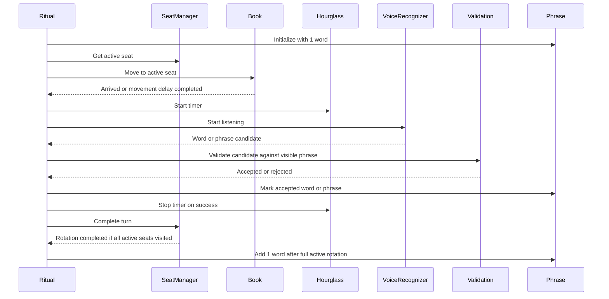

# Core Ritual Loop Architecture

Purpose: define the Core Ritual Loop architecture direction for Incantation.

Questions answered here:

- How should the ritual loop be coordinated?
- Which systems should own turn, phrase, validation, book, and timer responsibilities?
- What migration direction should future work preserve?

This document does not contain current task planning, full current status, scene setup, or permission to touch paused systems.

Read next: `Docs/PROJECT_KNOWLEDGE.md` for the current code map and `Docs/TechnicalArchitecture.md` for broader ownership boundaries.

## Purpose

This document defines the Core Ritual Loop architecture direction for Incantation.

It is a design reference. It does not authorize gameplay changes, scene changes, networking changes, visual changes, or implementation work by itself.

The current project state is a v0.1 playable local ritual prototype. The next major milestone is lobby.

## Design Pillars

- The book is the main character of the ritual.
- The hourglass is the pressure system.
- Voice interaction is central.
- Players remain seated for the full ritual.
- Characters do not walk around.
- One real cursed book moves between seated players.
- The shared ritual phrase grows by one word after a full active table rotation, not after every individual turn.
- The book follows the configured physical seating order around the table, not seat numbering or player connection order.
- `WordByWordRealtime` is the default prototype validation mode.
- `FullPhrase` is an optional strict validation mode.
- `WindowsKeywordVoiceRecognizer` is currently preferred for realtime prototype gameplay.
- Whisper remains available but must not be forced as the only validation path.
- The ritual word vocabulary stays separate from `SpellPhraseLibrary`.
- Unity Dictation and Azure must not be reintroduced.

## Current v0.1 Runtime Flow

1. Local debug occupants fill active seats for Play Mode testing.
2. Ritual state initializes.
3. The phrase starts with 1 word.
4. `SeatManager` identifies the current active seat according to physical table order.
5. The one real book moves to the active seat.
6. The hourglass starts.
7. The current shared phrase is displayed.
8. The selected voice recognizer listens.
9. In `WordByWordRealtime`, recognized keywords are checked against the next expected word.
10. Correct words are visually absorbed in realtime.
11. Wrong words produce rejection feedback while time remains.
12. In `FullPhrase`, a transcript candidate is compared against the full current visible phrase.
13. When the phrase is accepted, the turn succeeds.
14. The book moves to the next active seat.
15. After every active seat has been visited once, the phrase gains exactly 1 word.
16. The loop repeats.

## Desired Production Flow

1. Player joins lobby.
2. Player readies.
3. Lobby rules decide when the ritual can begin.
4. Players are seated automatically.
5. Core ritual state initializes from occupied seats.
6. The one real book moves through physical seats.
7. The hourglass creates turn pressure.
8. Voice validation accepts or rejects the current phrase according to the selected mode.
9. Turns advance through active seats.
10. Full active rotations grow the phrase.
11. Timeouts, failures, eliminations, and game-mode endings resolve the ritual.

Networking is not implemented yet and should not be assumed by architecture tasks.

## System Ownership

### Ritual Orchestration

Current prototype orchestration is represented primarily by `RitualController`, with newer core-loop components available for migration.

Responsibilities:

- Start and stop ritual attempts.
- Coordinate book movement, hourglass pressure, voice listening, phrase validation, feedback, and turn advancement.
- Respect the selected voice validation mode.
- Keep the phrase shared across active players.
- Add words only after full active table rotations.

Does not own:

- Physical seat order.
- Visual-only book placement references.
- Spell/card phrases.
- Networking transport.
- Demon reactions.
- Notebook state.
- Scene art.

### SeatManager

`SeatManager` owns the physical table order and active seat traversal.

The current clockwise order is:

1. Seat1
2. Seat5
3. Seat3
4. Seat6
5. Seat2
6. Seat7
7. Seat4
8. Seat8

Counter-clockwise order is the exact reverse.

`SeatManager` must not derive traversal from:

- Sequential seat numbering.
- Hierarchy order.
- GameObject names.
- Player join order.
- Network player index.

Future traversal rules may temporarily alter how the configured physical order is walked, including reverse rotation, random next player, skip occupied seat, double jump, or similar effects. These rules must not move physical-order ownership out of the Seat system.

### Book Movement

The current book behavior is represented by `BookMover`, `BookController`, and `SeatManager` book helpers.

Responsibilities:

- Move the one real book object to a seat destination.
- Use `Seat.GetBookDestination()` behavior where applicable.
- Prefer `BookGhost` when the current setup uses it as a visual destination reference, otherwise use `BookTarget`.
- Smoothly interpolate book position and rotation.
- Allow the ritual to move the book after phrase acceptance.
- Follow Seat system traversal.

Does not own:

- Phrase text.
- Phrase validation.
- Voice recognition.
- Hourglass duration.
- Player readiness.
- Lobby rules.
- Elimination rules.
- Demon reactions.
- Cards.
- Networking transport.

`BookGhost` must remain a visual placement reference and must not contain gameplay scripts.

### Phrase Ownership

The phrase system owns the shared ritual phrase.

Responsibilities:

- Initialize the phrase with 1 word.
- Expose the current visible phrase.
- Track current expected words.
- Add exactly 1 word after a full active table rotation.
- Keep ritual words separate from `SpellPhraseLibrary`.

Does not own:

- Seat traversal.
- Book movement.
- Microphone implementation.
- Networking transport.
- Spell/card phrases.

### Voice Recognition And Validation

Voice recognition and validation are separate.

Recognizers produce candidates.

Validation decides whether those candidates satisfy the current visible phrase.

Current modes:

- `WordByWordRealtime`: default prototype mode. Recognized keywords are validated against the next expected word for immediate acceptance and visual absorption.
- `FullPhrase`: optional strict mode. A full transcript is validated against the full current phrase.

Current recognizer guidance:

- Prefer `WindowsKeywordVoiceRecognizer` for the default realtime prototype loop.
- Use Whisper for full-phrase or experimental recognition when explicitly needed.
- Keep `WhisperSandbox` as a sandbox/reference area.
- Do not use Unity Dictation.
- Do not use Azure voice services.

Voice systems must not independently advance turns, mutate the phrase, eliminate players, or choose the next seat.

In network sessions, recognition remains local but submission ownership is authoritative.
`RitualController` forwards raw recognized text through the locally owned `NetworkPlayer`.
`NetworkRitualAuthority` derives sender identity from the FishNet connection, validates the
locked roster, active participant, ritual/turn/submission sequence, accepted Book arrival, timer
window, and text bounds. It then retrieves the server phrase and exclusively judges the accepted
submission through the existing deterministic `PhraseValidator`, publishing one immutable result.
`RitualController` applies that result to legacy progress, feedback, and consequences without
comparing speech itself. Offline recognition still evaluates and applies through the same
validator directly.

Network validation rejection remains retryable while authoritative time remains. A turn ends
only when an accepted validation completes the visible phrase or the server timer expires.
`NetworkRitualAuthority` validates that source and publishes exactly one immutable turn outcome.
It then selects and commits exactly one immutable consequence for that outcome: successful turns
produce `TurnSucceeded`, while authoritative timeouts produce `TimerExpired`.
`RitualController` waits for `ConsequenceCommitted` before entering its temporary legacy success
or timeout presentation pipeline. The consequence commit itself does not move the Book, change
Seats, eliminate a player, start Book Prison, advance the turn, or change ritual phase; those
executions remain behind the compatibility bridge.

### Hourglass

Offline, `HourglassController` retains local timer pressure for the prototype. In a FishNet
ritual, `NetworkRitualAuthority` owns duration, start, stop, deadline, and expiration;
`HourglassController` and `Timer` become presentation/compatibility consumers.

Responsibilities:

- Start pressure after authoritative Book arrival.
- Stop pressure on an accepted server stop request or ritual stop.
- Publish server-authoritative timeout for consequence selection by ritual authority.

Does not own:

- Voice validation.
- Phrase growth.
- Seat traversal.
- Book movement.
- Elimination rules beyond timeout signaling.

## Event Flow

The intended event flow is:

1. Ritual starts from occupied seats.
2. Phrase initializes.
3. Active seat is selected through `SeatManager`.
4. Book movement begins.
5. Book reaches the active seat.
6. Hourglass starts.
7. Voice listening starts.
8. Recognition candidates arrive.
9. Validation accepts or rejects the candidate.
10. Accepted words update visual feedback.
11. Accepted phrase completes the turn.
12. Hourglass stops.
13. Rotation progress updates.
14. Phrase grows if a full active rotation completed.
15. Book moves to the next active seat.

## Sequence Diagram

```mermaid
sequenceDiagram
    participant Ritual
    participant SeatManager
    participant Book
    participant Hourglass
    participant VoiceRecognizer
    participant Validation
    participant Phrase

    Ritual->>Phrase: Initialize with 1 word
    Ritual->>SeatManager: Get active seat
    Ritual->>Book: Move to active seat
    Book-->>Ritual: Arrived or movement delay completed
    Ritual->>Hourglass: Start timer
    Ritual->>VoiceRecognizer: Start listening
    VoiceRecognizer-->>Ritual: Word or phrase candidate
    Ritual->>Validation: Validate candidate against visible phrase
    Validation-->>Ritual: Accepted or rejected
    Ritual->>Phrase: Mark accepted word or phrase
    Ritual->>Hourglass: Stop timer on success
    Ritual->>SeatManager: Complete turn
    SeatManager-->>Ritual: Rotation completed if all active seats visited
    Ritual->>Phrase: Add 1 word after full active rotation
```

## Runtime State Machine

The ritual loop should prevent duplicate listening sessions, duplicate book movement, repeated hourglass starts, and turn advancement after failure.

Useful states:

- `Idle`
- `Initializing`
- `MovingBook`
- `TurnActive`
- `WaitingForRecognitionProcessing`
- `TurnSucceeded`
- `TurnFailed`
- `AdvancingTurn`
- `RotationCompleted`
- `RitualCompleted`
- `Stopped`

## Failure And Retry Rules

Initial architecture should support these outcomes:

- Valid word or phrase before timeout: turn progresses toward success.
- Wrong word before timeout: show rejection feedback and allow retry while time remains.
- Full phrase valid before timeout in `FullPhrase`: turn succeeds.
- Hourglass expires with no valid phrase: turn fails.
- Eliminated players are skipped after elimination exists.

The first production pass should keep elimination simple and avoid extra punishment systems until the core loop is reliable.

## Migration Guidance

Do not rewrite the working prototype all at once.

Current runtime reality:

- `RitualController` is still the working prototype orchestration surface.
- `CoreRitualLoop` is the cleaner logic direction.
- `CoreRitualLoopBridge` is a migration adapter while display and feedback still depend on `IncantationManager`.
- `TurnManager` currently tracks count-based turn order, while `SeatManager` remains the authority for physical seat traversal.

Read `Docs/PROJECT_KNOWLEDGE.md` before changing this migration boundary.

Recommended migration approach:

1. Keep the current ritual prototype stable.
2. Preserve `WordByWordRealtime` as the default feel.
3. Keep `FullPhrase` optional.
4. Keep one real book.
5. Keep `SeatManager` as physical order authority.
6. Introduce lobby and ready flow without breaking local ritual testing.
7. Replace debug occupants only after lobby seating is stable.
8. Add elimination only after retry and timeout behavior are clear.

## Out Of Scope

Do not include or modify these systems as part of core ritual architecture work unless explicitly requested:

- Notebook.
- Cards.
- Lore.
- Demon reactions.
- Networking.
- Voice chat.
- Spell system.
- `SpellPhraseLibrary`.
- Steam.
- Assets.
- Visual redesign.
- Scene layout.
- `WhisperSandbox`.
- Multiple gameplay books.
- Walking characters.

## Validation Requirements

For documentation tasks:

- No gameplay changes.
- No scene changes.
- No prefab changes.
- No asset changes.
- No code modifications.

For future implementation tasks:

- Compile in Unity after meaningful implementation steps.
- Validate the loop in Play Mode.
- Confirm one real book moves between seats.
- Confirm the book follows the configured physical seat order: Seat1, Seat5, Seat3, Seat6, Seat2, Seat7, Seat4, Seat8 clockwise.
- Confirm counter-clockwise traversal is the exact reverse.
- Confirm the ritual does not assume sequential seat numbering or player connection order.
- Confirm phrase starts with one word.
- Confirm all active players speak the same visible phrase.
- Confirm one word is added only after a full active table rotation.
- Confirm `WordByWordRealtime` is the default prototype validation mode.
- Confirm `FullPhrase` remains available as optional strict validation.
- Confirm `WindowsKeywordVoiceRecognizer` works for realtime prototype gameplay.
- Confirm Whisper is not forced as the only validation path.
- Confirm `SpellPhraseLibrary` is untouched.

## Architecture Summary

The ritual loop should stay focused and event-driven.

The book moves through physical seats. The hourglass creates pressure. Voice recognizers provide candidates. Validation checks the visible phrase according to the selected mode. Phrase growth happens only after a full active table rotation.

The next major milestone is lobby, not networking, cards, demon reactions, or art expansion.
