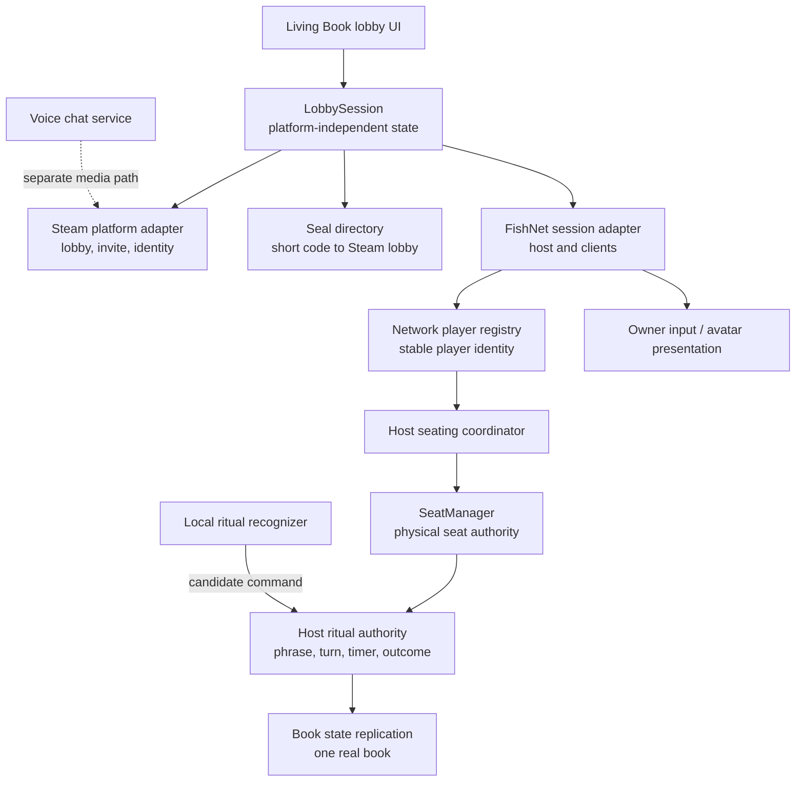

# Networking

Purpose: record the selected multiplayer framework and define the future networking architecture for Incantation.

Questions answered here:

- Which networking framework should Incantation use?
- Why was it selected over the main alternatives?
- Which state belongs to the host, each player, Steam, and local presentation?
- How should lobby creation, Seal joining, invitations, seating, voice, and ritual startup flow?
- What must a future `LobbySession` own?

This document records both the networking architecture decision and the installed foundation. FishNet connection lifecycle and the permanent per-connection `NetworkPlayer` architecture are operational; migration of lobby and gameplay systems onto that foundation remains in progress.

## Current Architecture

The implemented networking architecture is:

```text
Bootstrap
↓
Persistent NetworkManager
↓
FishNet
↓
NetworkPlayer (one per connection)
↓
Lobby Systems
↓
Gameplay Systems
```

The Bootstrap scene establishes the persistent `NetworkManager`, then opens `MainGame` so the
Living Book is available before a transport connection. `RitualSealService` provides the first
Book-driven create/join path for Tugboat LAN diagnostics: a host advertises a normalized
four-character Seal and a client resolves that Seal to an address internally before FishNet
connects. FishNet then creates one persistent, owner-assigned `NetworkPlayer` for each
connection and retains its global-scene synchronization path.

The LAN Seal is a locator, never an identity, password, connection ID, or gameplay authority.
It is intentionally isolated so the future Steam lobby metadata or external directory can
replace only lookup. No IP address or transport detail is displayed by the Book.

The NET-042.2 join flow distinguishes Seal lookup from the complete FishNet connection
lifecycle. Validate normalizes the Seal, broadcasts one directory query, and waits for
`ANNOUNCE`, `FULL`, or the configurable lookup deadline. `ANNOUNCE` supplies the sender address
and advertised Tugboat port, starts a stopped client exactly once, and begins a separate
configurable connection deadline. FishNet then reports transport state, synchronizes its global
scene, and `PlayerSpawner` creates the owner-assigned local `NetworkPlayer`. Local player
creation is the success boundary that clears the pending Join state.

The confirmed indefinite `Joining ritual...` cause was state ownership inside
`RitualSealService`: accepting `ANNOUNCE` cleared `pendingJoinSeal`, which was also the predicate
for the only timeout, and FishNet `Started` raised a UI refresh without changing
`RitualJoinStatus.Joining`. A successful connection therefore remained visibly pending, while a
transport attempt without a terminal callback had no remaining deadline. NET-042.2 keeps an
explicit attempt active across lookup, transport, scene synchronization, and local player spawn.
It reports `Ritual not found` for lookup expiry, `Ritual is full` for capacity, `Connection
rejected` for immediate or terminal FishNet failure, and `Connection timed out` only when an
accepted connection attempt exceeds its deadline. Timeout safely stops the incomplete local
client and makes Validate usable again. No authenticator or separate approval layer is currently
configured.

Technical diagnostics log directory resolution (including the resolved endpoint), client start
acceptance, every FishNet client state callback, scene synchronization start/end, and local
`NetworkPlayer` creation. The Book remains IP-free.

NET-042.3 establishes Circle membership as server-owned state on each connection's existing
`NetworkPlayer`. `NetworkPlayer.OnStartServer` registers that identity exactly once by setting
the replicated `IsCircleMember` SyncVar, and server stop plus network-object despawn remove it.
The authoritative roster is therefore the set of spawned, server-approved `NetworkPlayer`
identities whose synchronized membership flag is true. It is not a Seat roster, Hierarchy
count, display-name list, or Book-owned collection. `MaximumCircleMembers` owns the current
capacity of eight and Seal availability uses the same synchronized member count.

The confirmed pre-NET-042.3 failure was not transport or scene synchronization. A second
`NetworkPlayer` spawned correctly, but no Circle-membership property or registration lifecycle
existed. In parallel, `BookStateController` rendered a local serialized
`currentLobbyPlayerCount` fixed at one and entered `BookState.Lobby` only through local menu
navigation. The client consequently stopped at `Ritual joined.` and the host continued to render
`Players (1 / 8)`.

Every peer now maintains a read-only runtime view of the spawned network identities and counts
only those with the replicated membership flag. `CircleRosterChanged` refreshes the Circle page
when synchronized membership changes or a member despawns. `BookStateController` also queries
`IsLocalPlayerCircleMember` and `CircleMemberCount` on startup and re-enable, so late UI
subscription does not require the original event to repeat. A joined non-host displays
`THE CIRCLE` only when both the existing Join lifecycle is complete and its local
`NetworkPlayer` has authoritative synchronized Circle membership. Selecting `Create Ritual`
now calls the existing `RitualSealService.CreateRitual()` path immediately from the Play page.
The Book treats Host creation as complete only when `RitualSealService.IsHostingRitual` confirms
an active Seal plus Started FishNet server and local client; pending and failure status refresh
on the same page without a second Host-start request. The Host still chooses `Enter the Circle`
after creation. Local-player despawn clears the joined Seal state before the
Book returns to its existing main-menu state, preventing stale Circle membership after
disconnect.

Host shutdown is owned by `RitualSealService.QuitHostedRitual()`. It clears the authoritative
Seal and pending join/creation presentation, then delegates to
`FishNetFoundationController.Disconnect()`, which stops the local client and calls the FishNet
server stop path with remote-client shutdown enabled. The Book's `Quit Ritual` action invokes
that authority and restores the Play page. Circle `Back` never calls this path; it only returns
to the active Host Book page and preserves the session.

`NetworkPlayer` is the permanent networking identity of every connected player. Its replicated
state currently includes Circle membership, Priest Name, Lobby Player State, Ready State, Seat
ID, and High Priest.

Future systems should use `NetworkPlayer` as the authoritative multiplayer source whenever possible. Avoid creating duplicated lobby state outside `NetworkPlayer`; presentation components should observe or adapt its state instead of becoming competing authorities.

NET-042.5 makes the existing `NetworkPlayer.ReadyState` SyncVar the only multiplayer Ready
authority. The owning client calls `RequestToggleReady`; a non-host owner sends one server RPC,
and the server validates that the requesting player is still a Circle member before toggling
between `NotReady` and `Ready`. Clients never write the SyncVar and no local prediction occurs.

`ReadyCircleMemberCount` iterates the existing active `NetworkPlayer` roster and counts only
players for whom both `IsCircleMember` and `IsReady` are true. `BookStateController` reads this
value for the counter and reads the local synchronized `IsReady` value for the Ready/Unready
action. Ready changes reuse `CircleRosterChanged`, so every open Book refreshes from synchronized
state without polling. A late join receives each existing player's Ready SyncVar in the spawn
snapshot. Despawn removes that player from the roster, and a reconnect creates a new
`NetworkPlayer` whose default is `NotReady`.

Future start logic may observe readiness without changing synchronization by requiring a
non-empty Circle and comparing `ReadyCircleMemberCount == CircleMemberCount`. That consumer must
not write Ready state or infer it from Book text.

The current foundation has successfully validated host startup, client connection, `NetworkPlayer` spawning, local player ownership, remote player replication, disconnect, and shutdown.

Read next: `DECISIONS.md` for the durable decision summary, `Docs/TechnicalArchitecture.md` for current system ownership, or `Docs/NEXT_TASK.md` for the active production task.

## Decision

Use **FishNet** as Incantation's future realtime networking framework.

Use a host-client topology:

- One player runs the authoritative FishNet server and also plays as a client.
- The other 1–7 players connect as clients.
- Steamworks owns Steam lobby creation, lobby discovery, invitations, Steam identity, and platform-level connection information.
- FishNet uses a compatible Steam Networking transport for game traffic.
- Voice chat remains a separate service from FishNet game-state replication and from ritual voice recognition.

FishNet `4.7.2` and its included Tugboat transport are installed for local diagnostics. Steamworks.NET, FishySteamworks, and voice chat remain deferred until separately scoped compatibility tasks.

## Why FishNet

Incantation has a small player count, a single authoritative shared ritual, seated characters, and only a few important synchronized objects. It does not need shooter-scale rollback or a cloud-first session model. It needs clear authority, smooth object replication, Steam host-client support, low operational cost, and an API that can remain isolated behind game-specific services.

FishNet is the strongest fit because:

1. Its server-authoritative default matches the ritual. The host can own the book, phrase, timer, seat assignments, turn advancement, and elimination.
2. It directly supports a player acting as both server and client, which matches the requested host-client topology.
3. Its transport abstraction supports Steam transports without coupling gameplay rules to Steam APIs.
4. It provides mature object ownership, RPC, synchronized-state, prediction, and transform tools without requiring Incantation to adopt a cloud session product.
5. It is free and does not impose CCU caps or require per-player cloud networking fees.
6. Its current documentation explicitly supports Unity 6+, and the project has active releases.
7. It offers more networking headroom than Incantation presently needs while allowing a simple server-authoritative implementation.

The principal tradeoff is vendor risk: FishNet is a third-party framework with a smaller ecosystem than Unity's official stack or Mirror. Incantation should manage that risk by keeping FishNet types at the network boundary, not inside the core ritual domain.

## Framework Comparison

Assessment date: 2026-07-23. Support and licensing must be rechecked before package installation.

| Criterion | Unity Netcode for GameObjects | FishNet | Mirror | Photon Fusion |
| --- | --- | --- | --- | --- |
| Unity 6 support | Excellent and first-party. Unity positions NGO for smaller GameObject-based multiplayer games. | Explicit Unity 6+ support; actively released. | Repository explicitly lists Unity 6; actively released. | Fusion 2.1 explicitly supports Unity 6.0.x and 6.3.x. |
| Steam compatibility | Possible through community Steam transports or by using Unity Transport/Relay instead. The Steam path is not the first-party default. | Good through the transport abstraction and a compatible Steam transport such as FishySteamworks. Exact compatibility must be proven in a spike. | Good through transports such as FizzySteamworks, which Mirror documents as Steam P2P/relay capable. | Steam identity and invites can be bridged to Photon sessions, but gameplay traffic normally uses Photon Cloud rather than Steam P2P. |
| Host-client support | Native `StartHost` client-server topology. | Native server plus local client operation. | Native host server where one player is server and client. | Native Host Mode with state authority on the host. |
| Lobby support | Unity Lobby/Relay/MPS integrate well, but Steam Lobby is a separate integration. | No platform lobby service; deliberately pair with Steamworks Lobby. | No platform lobby service; deliberately pair with Steamworks Lobby. | Built-in Photon sessions/rooms, regions, and matchmaking. Steam invitations still require a bridge. |
| Learning curve | Low to moderate. Strong Unity tutorials and familiar component model. | Moderate. Broad feature set and terminology require discipline, but the server-authoritative model is clear. | Low to moderate. UNet-style Commands, RPCs, and SyncVars are widely understood. | Moderate to high. Tick simulation, state/input authority, prediction, and Photon session concepts add concepts Incantation does not currently need. |
| Performance | More than sufficient for 2–8 seated players; not the main differentiator. | Excellent headroom, efficient serialization and transform/prediction tooling; far beyond current load requirements. | Sufficient for Incantation; mature transports and serialization. | Excellent latency, prediction, interpolation, and tick simulation; optimized for substantially more demanding action games. |
| Community maturity | First-party Unity ecosystem, samples, official packages, and services. | Established and active, but smaller than Mirror and dependent on a third-party maintainer/community. | Largest and oldest open-source community in this comparison; extensive examples and integrations. | Mature commercial product with strong documentation, samples, and vendor support. |
| Long-term maintenance | Strongest engine alignment, though Unity service direction and community Steam transport compatibility remain dependencies. | Good current activity. Mitigate third-party risk through adapters and version pinning. | Strong open-source longevity and activity; API history is mature, though legacy patterns and third-party transports remain considerations. | Strong commercial maintenance, but creates Photon service, licensing, SDK, and pricing dependency. |
| Authority model | Server authority by default; owner or distributed-authority options exist. | Server authoritative by design; server assigns or transfers client ownership. | Server authoritative by default; client authority can be assigned, while synchronized state remains server controlled. | Explicit state authority and input authority; powerful but more complex. |
| Incantation fit | Very good general fit, especially if Unity Lobby/Relay replaces a Steam-native stack. Steam transport is the main weakness. | **Best fit.** Clear host authority, Steam transport path, no CCU dependency, and enough performance without cloud-first complexity. | Very good and safest open-source fallback. FishNet is preferred for its more modern networking toolset and performance headroom. | Technically excellent but disproportionate. Cloud/CCU dependency and extra simulation complexity do not buy much for a seated 2–8 player ritual. |

Performance is not a deciding factor among these options. All four can comfortably handle Incantation's expected object count and player count when implemented correctly.

## Why The Alternatives Were Not Selected

### Unity Netcode for GameObjects

NGO is the strongest alternative if first-party Unity alignment becomes more important than Steam-native networking. It fits a small GameObject game and has excellent Unity 6 support.

It was not selected because Incantation is explicitly Steam-first. NGO's official path naturally favors Unity Transport and Unity Multiplayer Services, while a Steam P2P transport depends on a community-maintained integration. This adds the same third-party transport risk as FishNet without FishNet's stronger networking feature set.

Reconsider NGO if the production plan changes to Unity Lobby plus Relay, cross-platform services become more important than Steam-native lobbies, or FishNet/Steam transport compatibility fails the required technical spike.

### Mirror

Mirror is mature, proven, free, server authoritative, and has a documented Steam P2P/relay transport path. It is the lowest-risk fallback if FishNet proves unstable in the target Unity version.

It was not selected because FishNet offers a more modern feature set, stronger performance headroom, and flexible ownership/transport tooling while preserving the same simple host-authoritative model. Incantation should not switch merely for benchmark differences; a switch would require FishNet to fail compatibility or maintainability validation.

### Photon Fusion

Fusion has the strongest advanced simulation, prediction, cloud matchmaking, and commercial support in the comparison. It supports current Unity 6 releases and Host Mode.

It was not selected because Incantation does not need its action-game simulation complexity, and its normal operating model adds Photon accounts, App IDs, cloud regions, CCU licensing, traffic planning, and a second session system beside Steam. Steam invitations can be bridged, but the result is less Steam-native and more operationally dependent than the game requires.

Reconsider Fusion if Incantation later needs cross-platform cloud matchmaking, managed global connectivity, or advanced prediction that cannot be achieved economically with the Steam/FishNet path.

## Platform And Framework Boundaries

Networking is not one system. Keep these responsibilities separate:

| Layer | Future responsibility |
| --- | --- |
| Steam platform adapter | Steam login identity, lobby create/join/leave, lobby metadata, invitations, overlay callbacks, connection endpoint, and Steam voice transport if selected. |
| Seal directory | Generate, publish, search, expire, and resolve a short human-readable Seal to one Steam lobby. |
| `LobbySession` | Platform-independent lobby member state, readiness, connection lifecycle, host role, compatibility state, and transition to ritual. |
| FishNet adapter | Start/stop host or client, connection approval, spawning, RPC/message delivery, replication, disconnect events, and network time. |
| Seating coordinator | Host-authoritative mapping from stable player identity to logical Seat; delegates physical order to `SeatManager`. |
| Ritual network authority | Host-authoritative ritual snapshot and commands for phrase, turn, book, timer, failure, retry, elimination, and end state. |
| Player presentation | Owner-generated seated pose, head/eyes/hands, mouth activity, cosmetics, and local input; replicated within strict limits. |
| Voice chat | Capture, encode, transmit, receive, mute, and playback social voice. It never validates ritual speech. |
| Ritual recognition | Local recognizer produces candidates; the host validates submitted candidates against the authoritative visible phrase and turn. |

Core gameplay code should depend on interfaces and plain data contracts. It should not depend directly on FishNet, Steamworks, Photon, Mirror, or NGO types.

## High-Level Architecture



## Future `LobbySession` Architecture

`LobbySession` should be an application-level state machine, not a UI component and not a subclass of a networking framework type.

### Responsibilities

- Own the local view of session phase: `Offline`, `Creating`, `Joining`, `InLobby`, `Connecting`, `ReadyToStart`, `Starting`, `InRitual`, `Disconnecting`, or `Failed`.
- Track stable player identity, display name, lobby membership, ready state, compatibility state, and connection state.
- Know which member is host.
- Coordinate Steam lobby membership with FishNet connection state.
- Publish immutable snapshots/events for the Living Book lobby UI.
- Accept intents such as create lobby, join by Seal, accept invite, toggle ready, leave, and host start.
- Reject invalid transitions and expose actionable failure reasons.
- Survive UI page changes without making the Book UI the source of truth.

### Non-responsibilities

- It does not choose physical seat order.
- It does not move the book.
- It does not own the ritual phrase, timer, success, failure, or elimination.
- It does not capture or validate speech.
- It does not directly animate UI, characters, or scene objects.
- It does not expose FishNet connection IDs as permanent player identity.

### Identity

Use Steam ID as the platform identity for the Steam release. Inside gameplay, wrap it in a stable `PlayerId` value so the core game is not coupled to Steam's numeric type. FishNet connection IDs are temporary routing identifiers and must never determine seat order or permanent identity.

### Compatibility Gate

Before the host accepts a player into the playable session, compare at least:

- Application build/protocol version.
- Content compatibility version.
- Supported player limit.
- Requested game mode.
- Required networking protocol version.

Reject incompatible clients before seating or spawning ritual state.

## Planned Multiplayer Flow

### Create A Lobby

1. The player selects host from the Living Book.
2. `LobbySession` requests a private or friends-only Steam lobby for 8 members.
3. Steam returns the lobby ID and makes the creator lobby owner.
4. The host generates a short random Seal and publishes its normalized value or hash in Steam lobby metadata.
5. Lobby metadata also publishes build compatibility, session phase, mode, and host connection information.
6. FishNet starts server plus local client using the validated Steam transport.
7. The host enters the pre-ritual lobby as the first member.

### Join Using A Seal

1. The player enters a case-insensitive, human-readable Seal.
2. The Seal directory queries Steam lobbies using an exact metadata filter and an appropriate distance scope.
3. Zero matches returns a clear invalid/expired message. Multiple matches must never silently choose; the host must regenerate colliding Seals or the directory must disambiguate.
4. The client checks build compatibility and lobby capacity.
5. The client joins the Steam lobby, obtains host connection data, and starts the FishNet client.
6. The host approves the connection only if Steam identity, lobby membership, protocol version, and capacity agree.
7. `LobbySession` publishes the connected member to the lobby UI.

A Seal is a convenience locator, not a password or security boundary. Steam authentication and host connection approval remain authoritative.

If Steam lobby metadata search proves too slow or unreliable for short-code lookup, replace only the Seal directory with a minimal external mapping service. Do not move lobby or gameplay authority into that service.

### Join Through Steam Invitation

1. The host opens the Steam invitation overlay for the current lobby.
2. Steam sends the lobby invitation.
3. The invitee accepts either while running or from a cold launch.
4. The Steam adapter resolves the lobby ID and hands the same join intent to `LobbySession`.
5. The flow continues through the same compatibility, membership, connection, and approval path as Seal joining.

Invitation joining and Seal joining must converge after lobby resolution; they must not become separate gameplay paths.

### Ready And Start

1. Each connected client submits a ready-state request for its own player.
2. The host validates and replicates authoritative readiness.
3. Only the host can request ritual start.
4. Start is allowed only for 2–8 connected, compatible, ready members.
5. The host seating coordinator maps the stable roster to active logical Seats.
6. `SeatManager` remains the sole owner of configured physical order. Join order and connection ID do not define traversal.
7. The host publishes a start snapshot containing roster, seat assignments, traversal direction, initial phrase seed/state, network start time, and initial ritual phase.
8. Clients acknowledge scene/readiness completion.
9. The host begins the ritual only after the required acknowledgements or an explicit timeout policy.

### Disconnect

- Before ritual start, the host removes the member, releases its seat reservation, and recomputes start eligibility.
- During ritual, the game mode decides whether the player is eliminated, temporarily disconnected, or allowed a reconnect window.
- For the first implementation, host loss ends the session gracefully and returns clients to the lobby/menu with a clear reason.
- Host migration is deferred. It requires snapshot transfer, Steam lobby ownership changes, transport reconnection, and deterministic recovery; it should not be implied by the first multiplayer milestone.

## Player Authority Architecture

Use host authority for shared truth and owner authority only for bounded personal input/presentation.

| State or action | Authority | Replication rule |
| --- | --- | --- |
| Steam identity and lobby membership | Steam plus host verification | Clients cannot claim another Steam ID. |
| Ready request | Owning client requests; host decides | Host replicates final ready state. |
| Seat assignment | Host | Assigned by stable roster through seating coordinator; physical order remains in `SeatManager`. |
| Character identity/cosmetics | Owner requests; host validates | Host-approved value replicated to all. |
| Seated pose, head, eyes, hands | Owning client within limits | Rate-limited owner input or pose samples; remote clients interpolate. |
| Mouth activity for chat | Owning client presentation | Replicate a small activity value or derive locally from received voice, not raw audio through FishNet. |
| Book state and destination | Host | Clients animate the one scene book from host state; never spawn one book per player. |
| Phrase and accepted-word progress | Host | Host replicates authoritative phrase snapshot/progress. |
| Turn and active Seat | Host | Host advances only after authoritative ritual result. |
| Hourglass | Host start/end network time | Clients render locally from shared network timestamps; host decides timeout. |
| Voice recognition candidate | Active owning client submits | Host checks sender, active turn, sequence, timing, and expected phrase before accepting. |
| Failure, retry, elimination, winner | Host/game mode | Host replicates decisions and reason codes. |

### Player Object Boundary

Each connected player should have one network identity object owned by that client. It represents:

- Stable player identity reference.
- Connection/session status.
- Validated display and cosmetic selections.
- Ready intent.
- Bounded seated-presentation input.
- Commands the player is permitted to request.

It must not own:

- Physical seat order.
- Shared phrase.
- Book movement.
- Timer truth.
- Turn advancement.
- Elimination decisions.

### Voice Recognition Trust Model

The active player's machine runs the current Windows keyword or optional full-phrase recognizer
because microphone capture is local. In a network ritual, `RitualController` forwards each
recognized text candidate through the locally owned `NetworkPlayer`. Its owner-required server
RPC carries ritual, turn, and submission sequence values but no trusted player identity.
`NetworkRitualAuthority` derives the sender from the FishNet connection, verifies the locked
roster, active participant, accepted Book arrival, live timer window, sequence freshness, and
bounded normalized text, then publishes an immutable accepted-submission snapshot/event.

The authority passes every accepted submission through the existing deterministic
`PhraseValidator` rules against the server's current `IncantationManager` phrase and configured
validation mode. It publishes one immutable `RitualValidationSnapshot` for each submission.
Clients never compare recognized text with the expected phrase during a network ritual.
`RitualController` temporarily applies the server verdict to the existing word-replay,
feedback, and success/failure consequence flow. Offline recognition continues to evaluate and
apply locally through the same validator.

An accepted validation ends the turn only when it completes the authoritative visible phrase.
That completion and authoritative timer expiration converge on one server-only turn-outcome
commit. `TurnOutcomeSnapshot` records the ritual, turn, player, source validation/timer, outcome
sequence, type, and server timestamp. Exactly one outcome may be committed for a turn.
The authority deterministically maps that current outcome to exactly one immutable
`RitualConsequenceSnapshot`: `Success` becomes `TurnSucceeded`, and `TimerExpired` remains the
timeout consequence. It validates ritual, turn, player, and originating outcome sequences before
committing. `RitualController` consumes `ConsequenceCommitted` to enter the existing success or
timeout compatibility pipeline; clients do not infer gameplay consequences from validation,
timer presentation, or the outcome event.

This prevents a stale or non-active client from advancing the ritual, but it does not prevent a modified client from lying about recognized speech. For a social party game, that limited trust model is acceptable for the first release. Server-side audio recognition would add latency, privacy, bandwidth, and operational cost and is not justified unless cheating becomes a real problem.

## State Replication Strategy

Prefer semantic state and events over continuous transform traffic:

- Replicate book phase, target Seat, movement sequence, and authoritative start time. Let every client animate the same dramatic path locally, with correction only when needed.
- Replicate hourglass start/end network timestamps, not a timer value every frame.
- Replicate phrase version, words, accepted-word count, and validation outcome.
- Replicate seat occupancy as a stable `PlayerId` to Seat mapping.
- Replicate avatar pose at a modest rate with interpolation because players remain seated.
- Use reliable delivery for lobby state, seat assignments, phrase changes, turn results, and elimination.
- Use unreliable sequenced delivery where appropriate for frequent pose/presentation samples.
- Send late joiners or reconnecting clients a complete authoritative snapshot before incremental events.

## Failure And Security Rules

- The host validates every gameplay-changing client request.
- Never use UI state as authority.
- Never use a FishNet connection ID, join order, GameObject name, hierarchy order, or seat number sorting as physical traversal authority.
- Never expose a Seal as if it were authentication.
- Never let voice chat packets enter ritual validation.
- Never let a client move the shared book directly.
- Include sequence/version IDs so delayed RPCs cannot affect a later turn.
- Rate-limit client commands and reject malformed, duplicate, stale, or out-of-phase requests.
- Define timeouts for Steam lobby operations, network connection, scene readiness, and reconnect attempts.
- Return structured disconnect/failure reasons that the Living Book UI can explain.

## Historical TASK-037 Pre-Installation Audit

Audit date: 2026-07-23.

This section preserves the repository evidence recorded before FishNet installation. It is historical context, not current project status.

At the time of the audit, the project was a Unity `6000.0.56f1` local prototype. `MainGame.unity` contained the menu/lobby presentation, logical Seats, player objects, one real book, ritual orchestration, voice recognition, hourglass, lighting, ambience, and aftermath presentation. FishNet, Steamworks.NET, a Steam transport, and voice chat were not yet installed, and game scripts compiled into Unity's default runtime assembly.

The local lobby foundation currently calls directly into `SeatManager`, moves the local player GameObject, and starts `RitualController`. That is valid prototype behavior but is not a network boundary. The first integration must preserve the local loop while placing platform, connection, lobby, seating, and ritual authority behind application-level services.

The audit identifies five distinct kinds of existing behavior:

1. **Local:** machine-specific input, camera, UI, recognizers, debug tools, ambience, and purely cosmetic effects.
2. **Networked:** state or events that every connected machine must receive.
3. **Host authoritative:** shared gameplay truth decided by the server running on the host.
4. **Owner authoritative:** bounded presentation or intent originating from the client that owns its player object. The host still validates gameplay-changing requests.
5. **Observer only:** consumes replicated state to render feedback and never decides gameplay.

These labels can overlap. For example, the hourglass is networked and host authoritative, while its sand animation is local and observer only.

## Required Packages And Version Policy

The first installation task should add only the following package roles:

| Package role | Recommendation | Required for first connection spike | Policy |
| --- | --- | --- | --- |
| Networking framework | FishNet | Yes | Install a pinned stable release. Do not follow an unpinned Git branch. |
| Steam API wrapper | Steamworks.NET | Yes | Use the Unity Package Manager form with an exact release tag. Do not mix UPM, `.unitypackage`, and manual installation methods. |
| FishNet Steam transport | FishySteamworks, if its current pinned release supports the selected FishNet and Steamworks.NET versions | Yes for Steam test; no for the initial local transport smoke test | Treat the transport, FishNet, and Steamworks.NET as one compatibility set. |
| Local diagnostic transport | FishNet's included Tugboat transport | Yes | Keep it for editor/LAN diagnostics and automated smoke tests; it is not the production Steam transport. |
| Steamworks SDK redistributables | Supplied/required by Steamworks.NET and the Steam build process | Yes for Steam builds | Verify Windows x64 and IL2CPP placement in a built player. |
| Voice chat package | None in the first FishNet integration | No | Select and integrate separately after the session shell. Do not route microphone audio through FishNet. |

Transport recommendation:

- Use **FishySteamworks over current Steam Networking APIs** for production host-client traffic only after the compatibility spike proves its exact package combination.
- Keep **Tugboat** configured as a diagnostic alternative for same-machine, LAN, and non-Steam lifecycle testing.
- Do not use the deprecated `ISteamNetworking` API.
- Prefer a transport path that uses Steam relay-capable networking so player IP addresses are not exposed.
- Do not configure Multipass in the first milestone. Add runtime transport selection only after each transport works independently and the session adapter has an explicit selection policy.

Exact version numbers are deliberately not recorded by TASK-037. Versions must be selected, pinned, license-checked, and recorded by the installation spike because FishNet, FishySteamworks, Steamworks.NET, Unity 6, and IL2CPP compatibility changes independently.

## Planned Folder And Assembly Structure

Do not move or rename existing systems during the first integration. Add networking beside them:

```text
Assets/
  Prefabs/
    Networking/
      IncantationNetworkManager.prefab
      NetworkPlayer.prefab
      NetworkSessionState.prefab
  Scripts/
    Networking/
      Application/
        LobbySession.cs
        NetworkSessionCoordinator.cs
        SessionContracts.cs
      FishNet/
        FishNetSessionAdapter.cs
        FishNetConnectionAuthenticator.cs
        NetworkPlayer.cs
        NetworkSessionState.cs
        NetworkRitualAuthority.cs
      Steam/
        SteamPlatformAdapter.cs
        SteamLobbyAdapter.cs
        SteamInviteAdapter.cs
        SealDirectory.cs
      Seating/
        NetworkSeatingCoordinator.cs
        SeatAssignmentSnapshot.cs
      Ritual/
        RitualSnapshot.cs
        RitualCommand.cs
        RitualResult.cs
      Presentation/
        NetworkPlayerPresentation.cs
      Voice/
        NetworkRecognitionCandidate.cs
  Tests/
    EditMode/
      Networking/
    PlayMode/
      Networking/
```

Before adding those scripts, introduce game-owned runtime and test assembly definitions in a dedicated task. Keep FishNet-dependent code in a networking assembly and keep plain session/ritual contracts in a framework-independent assembly. Existing gameplay code should consume interfaces and snapshots, not import `FishNet.*` or `Steamworks.*` namespaces.

Do not create a second parallel `Assets/Scripts` versus `Assets/scripts` hierarchy as part of networking. The repository currently contains mixed path casing; choose the existing canonical path on disk and normalize casing only in a separate, reviewed cleanup task because Windows can hide case-only conflicts.

## Original Scene Setup Plan

The first integration should use two scene roles:

1. **Bootstrap/session scene**
   - Contains the one persistent `IncantationNetworkManager`.
   - Contains platform bootstrap and `LobbySession` composition.
   - Starts offline and does not auto-start server or client.
   - Has no ritual gameplay objects.
   - Survives transition into the gameplay scene through a global spawned network object or another FishNet-supported persistent object strategy.

2. **MainGame gameplay scene**
   - Retains the table, logical Seats, one real scene book, hourglass, ritual presentation, lobby/menu presentation, characters, ambience, and lighting.
   - Is loaded for all connected peers through FishNet scene management.
   - Contains scene references and scene network identities only where shared scene state requires them.
   - Does not contain another `NetworkManager`.

This is the production direction, not permission to create or edit scenes in TASK-037. The first implementation may temporarily test FishNet lifecycle in an isolated test scene before introducing the bootstrap scene.

Scene setup rules:

- There must be exactly one active FishNet `NetworkManager`.
- Do not use the FishNet demo HUD in production. A diagnostic HUD is acceptable only in the isolated spike scene.
- Configure `ObserverManager`, `ServerManager`, `ClientManager`, `TransportManager`, `TimeManager`, and FishNet `SceneManager` on the manager prefab using the defaults proven by the spike.
- Disable automatic host/client start. `LobbySession` and the session adapter initiate lifecycle explicitly.
- Load `MainGame` through FishNet's scene manager after connection approval; do not allow each client to call Unity scene loading independently.
- Require a scene-loaded/readiness acknowledgement before the host assigns ritual-ready state.
- Treat scene object IDs and spawned prefab IDs as serialization details, never as stable player or Seat identity.
- Keep `Room`, lighting, ambience, cameras, menu pages, `BookGhost`, and Seat target transforms non-networked unless later evidence proves a network identity is necessary.

## Original NetworkManager Setup Plan

Create one project-owned `IncantationNetworkManager` prefab based on a clean FishNet manager configuration, not a modified demo prefab.

Its composition should be:

| Component/service | Responsibility |
| --- | --- |
| FishNet `NetworkManager` and manager components | Network lifecycle, connections, time, object spawning, observers, and synchronized scene loading. |
| Production Steam transport | FishNet packet transport selected only after Steam initialization and lobby resolution. |
| Diagnostic Tugboat transport | Local/LAN validation in development builds or the isolated spike. |
| `FishNetSessionAdapter` | Converts application intents into FishNet start/stop operations and converts FishNet callbacks into application events. |
| `FishNetConnectionAuthenticator` | Validates protocol/build, Steam identity, Steam lobby membership, capacity, and duplicate identity before player spawn. |
| `NetworkSessionCoordinator` | Owns orderly create/join/start/leave/shutdown sequencing and failure recovery. |
| `NetworkSessionState` | Server-owned replicated roster, session phase, ready states, and start barrier. |

Do not put ritual rules, Seat traversal, phrase generation, voice recognition, book animation, UI transitions, or Steam lobby calls directly on the `NetworkManager` object.

Shutdown order must be explicit: stop ritual input, publish/record disconnect reason, stop FishNet client, stop FishNet server when hosting, leave the Steam lobby, release callbacks, and return application state to offline. Test repeated host/create/leave and client/join/leave cycles without restarting the application.

## Network Prefab Strategy

Only three network prefab roles are expected for the first implementation:

| Prefab/object | Spawned by | Ownership | Purpose |
| --- | --- | --- | --- |
| `NetworkPlayer` | Server after connection approval | Owning client | Stable player/session identity, ready intent, validated character choice, connection status, and bounded presentation input. |
| `NetworkSessionState` | Server once per session, preferably global/persistent | Server | Replicated roster, session phase, compatibility state, start barrier, and authoritative lobby snapshot. |
| `NetworkRitualAuthority` | Server when entering the ritual, or a server-owned scene object if the spike proves scene identity is more reliable | Server | Replicated ritual snapshot, turn commands, validation results, timer timestamps, and end state. |

The following are not separate spawned network prefabs in the first implementation:

- The cursed book.
- Each Seat.
- The hourglass.
- Phrase UI.
- Book page/menu UI.
- Cameras.
- `BookGhost` or `BookTarget`.
- Voice recognizers.
- Lighting and ambience.

Those scene objects observe `NetworkRitualAuthority` and animate locally. If a network identity is later required for the one real book, add it to the single scene book; never register or spawn one book per player.

## Player Prefab Strategy

Use one owner-assigned `NetworkPlayer` root per connection. Separate identity/state from the visible priest:

- The network root persists for the session and owns `PlayerId`, Steam ID reference, display name, connection state, ready intent, validated character/skin selection, and assigned Seat ID.
- The visual priest is a scene/presentation child or an instantiated presentation bound to that network root.
- The host validates character choice, seat requests, ready requests, and every ritual command.
- The owner may generate bounded head, eyes, hands, mouth-activity, and cosmetic intents.
- Remote peers interpolate presentation and never run another player's camera, input, microphone, or ritual recognizer.
- Enable the local camera, AudioListener, input actions, microphone capture, and ritual recognizer only for the owner.
- Do not add walking/network transform gameplay. Players remain seated. `PlayerMovement` is local prototype behavior and should be disabled for the network ritual.
- Do not make the visible character the source of stable identity or Seat order.

## Authority By Domain

### Book Authority

The host owns the book phase, movement sequence ID, source Seat ID, target Seat ID, movement start network time, arrival, and whether interaction is allowed. Clients render the one scene book's path locally using the semantic movement command. The host alone advances the active turn after confirmed arrival or a defined authoritative transition.

`BookMover`, `BookController`, rotation, text effects, aftermath, prison/spectator, absorption, and feedback components remain presentation consumers unless a specific rule is extracted into `NetworkRitualAuthority`. No client sends book transforms. Late joiners receive the latest semantic state and snap/catch up safely.

### Seat Authority

`SeatManager` remains local scene authority for the configured physical Seat order and
references. Each server-owned `NetworkPlayer.SeatId` is the replicated assignment for that
player. Together, the active `NetworkPlayer` collection is the authoritative player-to-Seat
mapping; `SeatManager` only resolves and presents that mapping.

Clients may request an available Seat before ready, but the host accepts or rejects the
request atomically. Clients apply replicated `SeatId` changes to their local Seat
presentation. `Seat.currentPlayer`, `Seat.isOccupied`, lobby dictionaries, click zones,
GameObject names, and FishNet connection IDs are not transmitted as authority.

Seat IDs must be serialized explicitly and validated as unique. The current physical order remains `Seat1`, `Seat5`, `Seat3`, `Seat6`, `Seat2`, `Seat7`, `Seat4`, `Seat8`; traversal uses `SeatManager`'s configured order, never lexical or numeric sorting.

### Lobby Authority

Steam owns lobby membership and lobby-owner identity at the platform layer. The FishNet host verifies Steam membership and owns playable roster, readiness, character acceptance, capacity, session phase, and start permission. `LobbySession` exposes the resulting state to `LobbyController` and book-menu presentation.

The current `LobbyController` must eventually become a presentation/input adapter. It must not directly move remote players, mutate shared Seat occupancy, or call `RitualController.StartRitual()` without a host-approved start snapshot and scene readiness barrier.

### Ritual Authority

The host owns:

- Ritual phase and monotonically increasing ritual/turn sequence IDs.
- Active Seat and traversal direction.
- Phrase seed or explicit word list, phrase version, and accepted-word index.
- Turn start/end network timestamps.
- Acceptance, rejection, retry, timeout, elimination, rotation completion, phrase growth, and end state.
- The rule that the phrase starts at one word and gains exactly one word after a full active table rotation.

Clients submit intents/candidates tagged with the current sequence and render authoritative results. The host does not trust a client-reported completion flag or timer.

`CoreRitualLoop`, `TurnManager`, `GrowingIncantationManager`, `IncantationManager`, `RitualController`, and bridge components currently contain overlapping local orchestration. Before network implementation, designate one host-side ritual facade as the only writer and make the other components event-driven collaborators. Do not network both orchestration paths independently.

### Voice Separation

Keep three voice paths separate:

1. **Ritual microphone capture and recognition:** local to the active owner. Windows keyword recognition remains the default realtime path; Whisper remains optional for full phrase.
2. **Ritual candidate command:** small normalized data sent through FishNet to the host with player, ritual, turn, phrase, and expected-word sequence IDs. The host validates active ownership, timing, sequence, and expected phrase.
3. **Social voice chat:** a future encoded media service using Steam voice/networking or another selected voice solution. It must not feed ritual validation.

Raw microphone audio, Whisper buffers, recognition models, learned aliases, and local audio-device selection are never synchronized by FishNet. Remote lip activity is observer presentation and can be derived from received chat audio or a small owner-generated activity signal.

### Steamworks Interaction

Steamworks is initialized before any Steam lobby or Steam transport action. The Steam adapter owns callbacks and converts `CSteamID` values into project contracts at its boundary.

Create flow:

1. Initialize Steam and confirm the logged-in user and App ID.
2. Create a private/friends Steam lobby with capacity eight.
3. Publish protocol, build/content version, mode, phase, host identity/endpoint, and Seal metadata.
4. Select the Steam transport and start FishNet server, then the host's local client.
5. Approve and spawn the host player through the same authentication path used for remote clients.

Join flow:

1. Resolve a Seal or Steam invitation to one lobby ID.
2. Join the Steam lobby and read authoritative metadata.
3. Reject obvious version/capacity mismatch locally.
4. Configure the transport with the lobby owner's connection identity and start FishNet client.
5. Let the host authenticator verify Steam identity, membership, protocol, capacity, and duplicates.
6. Spawn the owner-assigned player only after approval.

Steam lobby chat/metadata is discovery and preconnection coordination, not the authoritative gameplay channel. After FishNet connects, lobby/ready/ritual state is replicated through FishNet while the Steam lobby remains available for invitations and membership verification.

## Existing System Networking Matrix

This matrix covers every current runtime script family. “Host authoritative” means its gameplay decision must run on or be accepted by the host. “Observer only” means the existing component should render replicated state and must not become a network writer.

| Existing system/components | Classification | FishNet integration boundary |
| --- | --- | --- |
| Lobby: `LobbyController`, `LobbyPlayerStateController`, `LobbyPlayerState` | Networked; host authoritative shared state; owner-authoritative requests; local UI | Convert controllers to consume `LobbySession` snapshots. Owner requests seat/ready/character; host publishes accepted state and start. |
| Menu/book UI: `BookMenuController`, `BookMenuItem`, `BookRightPageController`, `BookStateController`, `BookState`, text/page/character/voice controllers, menu return interactable | Local; observer only | Display session state and send intents. Page state, transitions, cursor, and camera remain local. |
| Seats: `SeatManager`, `Seat` | Networked mapping; host authoritative assignment; local physical-order/reference registry | Host replicates `PlayerId` to Seat ID. Clients bind visuals to their local scene Seats. |
| Seat input/debug: `ChairClick`, `DebugSeatFlowSimulator` | Owner-authoritative request for clicks; debug simulator local only | Click submits a request. Simulator is disabled outside offline/test mode and never networked. |
| Ritual orchestration: `RitualController`, `CoreRitualLoop`, `CoreRitualLoopBridge`, `TurnManager` | Networked; host authoritative | One host facade writes ritual state. Clients receive snapshots/events; bridges may invoke presentation only. |
| Ritual debug: `CoreRitualLoopTestHarness` | Local only | Never present/enabled in production network sessions. |
| Phrase growth/data: `GrowingIncantationManager`, `IncantationManager`, `IncantationWord`, `IncantationWordLibrary`, `PhraseValidator`, validation result structs | Networked results; host authoritative validation/state; libraries and pure validation local on host | Host selects phrase/seed and validates candidates. Replicate plain words/version/progress, not MonoBehaviour or ScriptableObject references. |
| Incantation display: `IncantationTextDisplay` | Local; observer only | Renders authoritative phrase version, expected word, acceptance, and rejection. |
| Voice interfaces/recognizers: `IVoiceInput`, `IVoiceRecognizer`, processing status, `WindowsKeywordVoiceRecognizer`, `WhisperVoiceRecognizer`, `WhisperController`, `MockVoiceRecognizer`, `VoicePhraseNormalizer` | Local owner authority for capture/candidate; host authority for acceptance | Only active owner listens. Submit normalized, sequenced candidates. Mock stays test-only. |
| Voice sandbox: `WhisperSandboxUI` | Local only | Never enabled or synchronized in production sessions. |
| Hourglass rules: `HourglassController`, legacy `Timer` | Networked; host authoritative | Host owns start/end network time and timeout. Consolidate duplicate timer truth before ritual networking. |
| Hourglass presentation: `HourglassVisualController`, `HourglassWarningAudio`, `HourglassLightPossessionController` | Local; observer only | Render from authoritative timestamps and outcomes; do not send frame-by-frame state. |
| Book movement/control: `BookMover`, `BookController`, `BookRotationController`, `BookOrbitAroundTable` | Local-only during lobby/customization; networked semantic state with Host authority during ritual/game over | Each process owns its existing lobby Book presentation. At ritual handoff the visible Book and proxy reconcile to the authored start pose, then the existing shared command/NetworkTransform path resumes. |
| Book feedback and text: `BookFeedbackController`, `BookTextMagicEffect` | Local; observer only | React to authoritative validation/book events. |
| Book aftermath: `BookAftermathController`, `BookPrisonSpectatorController`, `DeathVisionVignetteController`, `DemonHandController`, `PlayerAbsorptionController`, `RitualFailureAbsorptionBridge` | Networked outcome trigger; host authoritative outcome; local observer presentation | Host decides failure/elimination/winner. Each client plays appropriate local presentation from reason-coded events. |
| Player identity/character selection: `CharacterSelectionGroup`, `CharacterSkinPalette` | Networked selection; owner request; host authoritative acceptance; observer presentation | Store approved character/skin on `NetworkPlayer`; instantiate/apply locally for all observers. |
| Seated body/head: `BodyMotion`, `HeadEffect`, `HeadIdleMotion` | Local or owner-authoritative bounded presentation; remote observer only | Prefer deterministic/local idle. Replicate only deliberate pose inputs at a modest rate if required. |
| `PlayerMovement`, `NetworkCharacterLookPose` | Owner-local input; compact owner-authored pitch/yaw relayed through the server for remote presentation | Do not network walking. Remote `PlayerMovement` stays disabled; observers call only its input-free procedural pose method. |
| Face/lip/audio activity: `EyelidBlinkController`, `VoiceLipController`, `VoiceAmplitudeProvider`, `WindowsAudioOutputDeviceProvider` | Local owner presentation; remote observer only | Blink may run locally. Lip activity derives from local/received audio or a small bounded signal; audio devices remain local. |
| Camera: `CameraTransitionManager`, `RitualCameraEffects` | Local only; observer presentation | Never replicate cameras or transitions. Trigger local effects from authoritative events when needed. |
| Lighting/fog: `FireLightFlicker`, `RitualLightingController`, `RoomVeilPreset`, `TableFogPreset`, `WallFogPanelPreset` | Local; observer only | Ambient effects run locally. Discrete ritual lighting cues may observe authoritative events. |
| Ambient audio: `AmbientRandomSoundPlayer` | Local only | Do not network random ambient clips in the first integration. Add a shared seed/event later only if synchronized timing is a design requirement. |
| Notebook: `NotebookController`, `NotebookInput`, `NotebookSpellPage` | Local and paused | No FishNet integration until explicitly re-enabled. |
| Spell/card systems: `SpellHandController`, `SpellCardView`, `SpellDefinition`, `SpellRarity`, `SpellPhrase`, `SpellPhraseLibrary`, `SpellPhraseRarity` | Paused; currently local data/presentation | No FishNet integration in the first milestone. Future card play must be owner request plus host-authoritative resolution. Keep spell phrases separate from ritual words. |

## Spawn And Start Flow

### Connection And Player Spawn

1. Application boots into offline session state; no server/client autostarts.
2. Platform adapter initializes Steam or selects diagnostic offline transport.
3. Host creates Steam lobby and starts FishNet server plus local client; client resolves and joins a Steam lobby, then starts FishNet client.
4. Client sends authentication payload containing protocol/build/content versions and verifiable Steam identity context.
5. Host validates identity, Steam lobby membership, capacity, duplicates, and compatibility.
6. On approval, server spawns exactly one owner-assigned `NetworkPlayer`.
7. Server adds its stable `PlayerId` to `NetworkSessionState`.
8. Client receives a full lobby snapshot before UI enables seat, character, or ready actions.

### Lobby To Ritual Spawn

1. Owners submit character, Seat, and ready intents; host validates and replicates each result.
2. Host alone requests start after all 2–8 connected compatible players are ready.
3. Host locks the roster and Seat assignments and publishes a start barrier.
4. FishNet loads `MainGame` for all peers or confirms it is loaded through the approved scene strategy.
5. Every client binds its local scene registry (`SeatManager`, book, hourglass, ritual presentation) and acknowledges readiness.
6. Server spawns or activates one `NetworkRitualAuthority`.
7. Server publishes a complete initial snapshot: roster, Seat map, traversal, phrase seed/list/version, accepted index, active Seat, turn sequence, timer start/end, book phase, and ritual phase.
8. Clients bind `NetworkPlayer` presentation to assigned Seat spawns and enable only the owner's camera/input/recognizer.
9. After required acknowledgements, host begins the first turn at a future network timestamp.

Do not let Unity `Awake`/`Start` order implicitly begin the ritual. Network startup requires the explicit barrier above.

## Host And Client Runtime Flows

### Host Flow

1. Initialize Steam and create the Steam lobby.
2. Start FishNet server, then local client, through `NetworkSessionCoordinator`.
3. Authenticate and spawn the host player through the normal connection path.
4. Validate every member action and publish lobby snapshots.
5. Lock roster, assign Seats, coordinate scene readiness, and create ritual authority.
6. Run ritual decisions, timer truth, phrase growth, book destination, failure, and elimination.
7. Replicate semantic state/events and periodic full snapshots where recovery requires them.
8. On remote disconnect, apply the current phase policy and publish the reason.
9. On host exit, end the session for all clients; host migration is not part of the first integration.

### Client Flow

1. Initialize Steam, resolve invitation/Seal, join the Steam lobby, and inspect compatibility metadata.
2. Start only the FishNet client using the resolved host identity.
3. Authenticate, wait for owned `NetworkPlayer`, then wait for the authoritative lobby snapshot.
4. Send only permitted owner intents; never mutate shared lobby, Seat, ritual, book, timer, or elimination state locally.
5. Load the network-directed gameplay scene and acknowledge scene binding.
6. Render the authoritative ritual snapshot and enable local microphone recognition only when this owned player is active.
7. Submit sequenced recognition candidates; keep retry UI responsive while awaiting results, but never predict success.
8. Interpolate presentation and book movement from semantic commands.
9. On disconnect or host loss, stop local input/recognition, display the structured reason, leave the Steam lobby, and return to offline/menu state.

## Historical Architectural Risks Before Installation

| Risk | Evidence in current project | Mitigation/gate |
| --- | --- | --- |
| Local lobby is gameplay authority | `LobbyController` directly selects Seats, moves the local player, and starts `RitualController`. | Introduce `LobbySession` snapshots/intents first; keep UI as presentation. |
| Multiple ritual writers | `RitualController`, `CoreRitualLoop`, bridges, turn, growing phrase, and incantation managers overlap. | Name one host ritual facade and document each collaborator's write boundary before adding RPCs. |
| Duplicate timer truth | Both legacy `Timer` and `HourglassController` exist. | Select one authoritative timeout source before synchronizing timestamps. |
| Scene-order coupling | Many scripts rely on serialized scene references and lifecycle callbacks. | Use an explicit scene binding/readiness barrier and full initial snapshot. |
| Legacy local Seat presentation | Offline/debug occupancy and visible-player binding still use `Seat.currentPlayer`. | Keep it out of network authority; resolve connected occupancy exclusively through `NetworkPlayer.SeatId`. |
| Runtime-created UI and broad object lookup | Lobby can create UI and find player movement at runtime; several systems use fallback searches. | Production network composition uses serialized interfaces/registries; avoid race-prone discovery after scene load. |
| No game assembly boundaries | Game scripts compile in the default assembly. | Add framework-independent and FishNet-specific asmdefs before integration to prevent dependency leakage. |
| Mixed path casing/duplicate-looking folders | Repository has both `Assets/scripts` and `Assets/Scripts` references on Windows. | Avoid case-only moves during networking; audit GUIDs and normalize separately. |
| Package compatibility triangle | FishNet, FishySteamworks, and Steamworks.NET evolve independently. | Pin a proven trio and retain a rollback commit; test editor, Mono development build, and Windows x64 IL2CPP. |
| Steam cannot be tested with one identity | Lobby membership, invites, relay, and authentication require real Steam conditions. | Require two Steam accounts and two machines for the compatibility gate. |
| Host advantage and trust | Host validates locally recognized candidates; remote clients report recognition text. | Accept for party-game v1, log reason-coded decisions, sequence every command, and never claim anti-cheat security. |
| Host loss | Listen-server owner is session authority. | First milestone ends session cleanly; do not promise migration. |
| Voice cross-talk | Social chat and ritual microphone capture can hear the same speech/playback. | Separate services, push-to-talk/mute policy, headphones guidance, and echo/capture testing. |
| Late/stale messages | Word-by-word input is rapid and turns change under timer pressure. | Include ritual, turn, phrase, and word sequence IDs plus server-time window validation. |
| Transform over-networking | Book and seated avatar visuals may tempt continuous reliable sync. | Replicate semantic book events/timestamps and modest unreliable pose samples only when needed. |
| Scene book duplication | Spawned-prefab thinking could create one book per connection or duplicate the scene book. | Keep one scene book and one server-owned ritual authority; assert uniqueness in validation. |
| Steam Seal assumptions | Lobby search is asynchronous, distance-filtered, and can return collisions. | Treat Seal as locator, handle 0/multiple results, set explicit filters/timeouts, and keep external directory fallback isolated. |

## Original FishNet Implementation Roadmap

Each step is a separate small task with documentation, compile/build validation, review, commit, and push. Do not combine package installation with gameplay conversion.

### Phase 0 — Approval And Baseline

1. Finish and commit all current unrelated lobby/scene/script work before starting networking.
2. Record a clean Unity compile, local lobby flow, Seat selection, ritual start, word-by-word acceptance/rejection, timeout, and book movement baseline.
3. Back up the exact `Packages/manifest.json`, package lock, Unity version, build target, scripting backend, and API compatibility settings.

Exit gate: clean worktree, known-good local prototype, and rollback point.

### Phase 1 — Isolated Package Compatibility Spike

1. Create an isolated branch and test scene.
2. Select and record exact FishNet, FishySteamworks, and Steamworks.NET releases plus licenses and source URLs.
3. Install FishNet and prove host/client lifecycle with Tugboat without changing gameplay.
4. Install Steamworks.NET and prove initialization/shutdown with the development App ID.
5. Install FishySteamworks and prove two-machine Steam host/client connect, disconnect, reconnect, and clean application shutdown.
6. Produce a Windows x64 IL2CPP build and repeat the two-account test.

Exit gate: a pinned, reproducible compatibility set or a documented failure that triggers the Mirror/FizzySteamworks fallback review.

### Phase 2 — Assembly And Contract Boundary

1. Add game-owned runtime/test assembly definitions.
2. Add plain `PlayerId`, Seat ID, lobby snapshot, connection result, and session phase contracts with no FishNet or Steam types.
3. Define `INetworkSession`, `IPlatformLobby`, and session event interfaces.
4. Add edit-mode tests for compatibility checks, state transitions, stable identity, and invalid transitions.

Exit gate: existing local gameplay still compiles and framework types cannot leak into core contracts.

### Phase 3 — Persistent Session Shell

1. Create the project-owned network manager prefab and bootstrap/test composition.
2. Implement explicit start server, start client, start host, stop, failure, and repeated lifecycle behavior behind `FishNetSessionAdapter`.
3. Add structured disconnect reasons and deterministic shutdown order.
4. Keep Tugboat as the initial validation transport.

Exit gate: repeated host/client connect and leave works without ritual integration or stale objects.

### Phase 4 — Steam Lobby And Connection Approval

1. Implement Steam create/join/leave, invitation, cold-launch invite, lobby metadata, and Seal resolution adapters.
2. Converge invite and Seal joins into one join intent.
3. Authenticate FishNet connections against Steam lobby membership, versions, capacity, and duplicate identity.
4. Switch to FishySteamworks only after Steam lobby resolution.

Exit gate: two machines can create, discover/invite, join, reject version mismatch, leave, and reconnect.

### Phase 5 — Network Player And Lobby State

1. Add one owner-assigned `NetworkPlayer` per approved connection.
2. Add one server-owned `NetworkSessionState`.
3. Replicate roster, names, validated character choice, connection state, Seat requests, ready state, and host role.
4. Adapt the existing lobby/book UI to snapshots and intents while preserving its visual behavior.

Exit gate: 2–8 simulated/real clients see the same lobby and only the host can start.

### Phase 6 — Authoritative Seating And Scene Barrier

1. Add stable Seat IDs without changing configured physical traversal.
2. Implement host seating coordinator and atomic Seat assignment.
3. Load/bind `MainGame` through FishNet scene management.
4. Spawn/bind player presentation at assigned Seat and enable only owner-local camera/input.
5. Require all client readiness acknowledgements before ritual start.

Exit gate: all peers show the same occupants in the same physical Seats; reconnect/leave does not corrupt occupancy.

### Phase 7 — Read-Only Ritual Snapshot

1. Add server-owned `NetworkRitualAuthority` and a complete ritual snapshot contract.
2. Replicate fixed test state for active Seat, phrase, accepted index, timer timestamps, and book semantic state.
3. Bind current UI, hourglass visuals, and book movement as observer-only consumers.
4. Test a late client snapshot in the diagnostic environment without enabling gameplay commands.

Exit gate: clients render identical ritual state while only the server changes the test snapshot.

### Phase 8 — Host-Authoritative Ritual Commands

1. Designate one ritual facade as the host writer.
2. Route turn progression, phrase growth, retry, timeout, and book arrival through it.
3. Add ritual/turn/phrase/word sequence validation and reason-coded results.
4. Preserve exactly one phrase word added after one full active table rotation.

Exit gate: host plus remote client complete multiple rotations with identical state and one real book.

### Phase 9 — Ritual Voice Candidate Path

1. Enable the recognizer only for the active owning player.
2. Submit normalized word/full-phrase candidates to the host with sequence metadata.
3. Validate active sender, timing, expected phrase, duplicates, and stale candidates on the host.
4. Replicate acceptance/rejection and drive current absorption/rejection feedback locally.
5. Test retries until authoritative timeout under latency and packet loss.

Exit gate: both host and remote clients can take voice turns; social voice remains absent/separate.

### Phase 10 — Hardening

1. Test 2–8 players, rapid ready toggles, Seat contention, scene load failure, client timeout, host loss, duplicate Steam identity, stale RPCs, version mismatch, and repeated sessions.
2. Test Windows x64 IL2CPP on two machines and two Steam accounts.
3. Profile bandwidth and eliminate unnecessary transform/state updates.
4. Update `PROJECT_STATUS`, `PROJECT_KNOWLEDGE`, Inspector/scene references, and this document to describe the implemented truth.

Exit gate: the multiplayer lobby-to-ritual vertical slice is compiling, built, tested, documented, committed, and pushed.

## Implementation Milestones

Do not implement all networking at once.

1. **Compatibility spike:** in an isolated branch/sample, prove the exact Unity 6 version, FishNet version, Steamworks wrapper, Steam transport, two-machine connection, IL2CPP Windows build, and clean shutdown/reconnect. Do not alter gameplay during the spike.
2. **Platform lobby adapter:** create/join/leave Steam lobbies, invitations, cold-launch invite handling, metadata, and Seal lookup.
3. **Network session shell:** connect host and clients, approve identity/build/capacity, represent members, and handle disconnects.
4. **Networked `LobbySession`:** authoritative ready state and Living Book UI integration without physical ritual handoff.
5. **Authoritative seating:** map stable members to Seats through `SeatManager`.
6. **Ritual snapshot:** synchronize phrase, active Seat, timer timestamps, and the one book's semantic movement state.
7. **Player presentation:** synchronize seated avatar identity and bounded pose/mouth presentation.
8. **Voice paths:** add social voice chat separately, then route local ritual recognition candidates to host validation.
9. **Failure/reconnect hardening:** timeout, elimination, reconnect window, host-loss UX, and late snapshot recovery.
10. **Production testing:** packet loss/latency simulation, two-machine Steam testing, 2–8 player soak tests, malicious/stale command tests, and version mismatch tests.

Each milestone requires a separate focused task, documentation update, Unity validation, commit, and review.

## Historical Validation Gate Before Installation

At the time of TASK-037, the framework decision was approved but package selection was not. The pre-installation gate required:

1. Pin exact versions rather than following floating Git branches.
2. Confirm license compatibility for FishNet, the Steamworks wrapper, and the transport.
3. Confirm all three support the project's exact Unity 6 editor version and Windows IL2CPP target.
4. Confirm the Steam transport uses current Steam Networking APIs and relay behavior.
5. Prove host, remote client, lobby invite, Seal join, disconnect, reconnect, and shutdown on two Steam accounts and two machines.
6. Record package ownership, upgrade procedure, rollback plan, and known limitations.

If the FishNet Steam spike fails, evaluate Mirror plus FizzySteamworks next. Do not silently substitute a framework.

## Sources

Primary sources reviewed for this decision:

- [Unity: choose Netcode for GameObjects for smaller GameObject-based multiplayer games](https://docs.unity.com/multiplayer/netcode/netcode)
- [Unity: Netcode for GameObjects Unity 6 tutorial and host/client setup](https://learn.unity.com/tutorial/668810b4edbc2a501c5c6d13?version=6.0)
- [Unity: Netcode for GameObjects ownership and authority](https://docs-multiplayer.unity3d.com/netcode/current/basics/ownership/)
- [FishNet: overview, server authority, host operation, and licensing position](https://fish-networking.gitbook.io/docs)
- [FishNet: installation methods and Git package path](https://fish-networking.gitbook.io/docs/tutorials/getting-started/installing-fish-networking)
- [FishNet: Unity compatibility](https://fish-networking.gitbook.io/docs/overview/readme/features/unity-compatibility)
- [FishNet: ownership](https://fish-networking.gitbook.io/docs/guides/features/ownership)
- [FishNet: transport abstraction](https://fish-networking.gitbook.io/docs/fishnet-building-blocks/transports)
- [FishNet: synchronized scene management](https://fish-networking.gitbook.io/docs/guides/features/scene-management)
- [FishNet: persistent and global network objects](https://fish-networking.gitbook.io/docs/guides/features/scene-management/persisting-networkobjects)
- [FishNet: official repository and releases](https://github.com/FirstGearGames/FishNet)
- [Steamworks.NET: Unity installation and pinned UPM release guidance](https://steamworks.github.io/installation/)
- [Mirror: host-server model](https://mirror-networking.gitbook.io/docs/manual/general)
- [Mirror: authority](https://mirror-networking.gitbook.io/docs/manual/guides/authority)
- [Mirror: FizzySteamworks transport](https://mirror-networking.gitbook.io/docs/manual/transports/fizzysteamworks-transport)
- [Mirror: official repository and Unity 6 support statement](https://github.com/MirrorNetworking/Mirror)
- [Photon Fusion: Unity 6 requirements and current SDK](https://doc.photonengine.com/fusion/v2/getting-started/sdk-download)
- [Photon: current CCU pricing and licensing](https://doc.photonengine.com/photon/current/pricing)
- [Steamworks: matchmaking, lobbies, metadata, invitations, authentication, and voice boundary](https://partner.steamgames.com/doc/features/multiplayer/matchmaking)
- [Steamworks: current networking APIs and Steam Datagram Relay](https://partner.steamgames.com/doc/features/multiplayer/networking)

## Authoritative Player Appearance

`NetworkPlayer` owns one server-authoritative `SyncList<AppearanceSlotValue>` for each connected
player. Every entry contains only an `AppearanceSlot` and integer `ValueId`; no GameObject,
Renderer, Material, mesh, prefab, or component reference crosses the network.

The owner changes a cosmetic through the existing Character Book UI. `CharacterSkinPalette`
and `CharacterSelectionGroup` publish selection events to `CharacterAppearancePresentation`.
`NetworkCharacterPresentation` forwards the changed slot to its owning `NetworkPlayer`, which
sends one server RPC when the owner is a remote client. The server validates the lightweight
value and adds or replaces only that slot in the SyncList.

FishNet sends the complete list with the `NetworkPlayer` spawn snapshot, so late joiners apply
all current appearances without refresh, respawn, or menu interaction. Runtime changes use a
single SyncList Add or Set delta and apply only the changed slot. Disconnecting despawns that
player's `NetworkPlayer` and its presentation, so appearance data cannot leak to a later
connection. A reconnecting owner republishes the appearance still selected by its local
customization components to its new server-owned player object.

`CharacterAppearancePresentation` is the local application boundary. It maps synchronized data
onto the existing skin palette and selection-group components. `NetworkPlayer` contains no
renderer, material, mesh, activation, or cosmetic presentation logic.

To add a cosmetic slot:

1. Add a stable value to `AppearanceSlot`; never renumber shipped values.
2. Add or reuse a local presentation component/catalog whose integer indices are identical on
   every client.
3. Tag its `CharacterSelectionGroup` with that slot, or extend
   `CharacterAppearancePresentation` for a different data type such as a palette color.
4. Keep validation in the local catalog and server request boundary. The SyncList and late-join
   lifecycle require no redesign.

## Status

TASK-038 installed the FishNet foundation and TASK-039 established the permanent per-connection player architecture on 2026-07-23:

- FishNet is pinned to official tag `4.7.2` through Unity Package Manager.
- Tugboat is the configured local diagnostic transport on port `7770`, connecting to `localhost`.
- `Assets/Scenes/Bootstrap.unity` contains one project-owned persistent `IncantationNetworkManager`.
- The manager prefab explicitly configures FishNet's server, client, transport, time, scene, and observer managers.
- `PlayerSpawner` creates one owner-assigned `NetworkPlayer` prefab for each connection.
- `NetworkPlayer` is the single source of truth for its server-generated session Player ID,
  connection/owner/local identity, high-priest role, priest name, lobby state, ready state,
  Seat ID, and appearance-slot data.
- High-priest role, priest name, lobby state, and ready state use FishNet `SyncVar` storage and expose change events plus server-only mutation APIs.
- Ready toggles use an owner request, server validation, SyncVar replication, and the existing
  Circle roster. The Book counter counts synchronized Circle members whose Ready state is Ready.
- Seat ID uses FishNet `SyncVar` storage. Owner requests are validated by the server,
  duplicate active Seat assignments are rejected, and every observer resolves occupancy
  from `NetworkPlayer.SeatId`.
- `SeatManager` maps Seat IDs from the configured clockwise physical order without storing a
  second Seat ID on `Seat`. Legacy `Seat` occupant state remains only for offline/debug
  compatibility and player presentation.
- `NetworkCharacterPresentation` is attached once to the `NetworkPlayer` prefab. Every client
  binds exactly one visible character per observed player: the owner claims the existing scene
  character and each non-owner creates an independent visual instance. Seat changes move only
  the character belonging to the changed `NetworkPlayer`; disconnect releases that Seat and
  destroys only that player's non-owner instance.
- Presentation binding is retried from each `NetworkPlayer.OnStartClient` lifecycle callback.
  This is required for Host mode, where a remote player's Unity `Start` can run during server
  initialization before the same object becomes initialized on the Host client. Dedicated
  servers never receive that client callback and therefore do not create visual characters.
- Remote character instances disable their cameras, audio listeners, and local look controls.
  The existing scene character, character preview, offline flow, and debug flow remain intact.
- `NetworkCharacterLookPose` follows each persistent `NetworkPlayer`. It samples only the owning
  presentation's `PlayerMovement`, submits bounded pitch/yaw at 15 Hz when changed (plus a
  settled-pose heartbeat), and relays the latest buffered pose to non-owner observers. Remote
  visual instances reuse the same procedural bone formula without enabling mouse input. This
  cosmetic state is independent from ritual phase and alive/dead state.
- Player appearance is synchronized as server-owned `(AppearanceSlot, ValueId)` data through a
  FishNet SyncList. Local character presentation applies the initial snapshot and per-slot
  runtime deltas through the existing customization components.
- `LobbyPlayerStateController` temporarily preserves the existing local lobby and will become an adapter/consumer rather than a competing permanent state owner.
- Completed-match return starts a fresh authoritative seating phase. The server resets each Circle
  member to `NotReady`, `LobbyPlayerState.NotSeated`, and `SeatId = -1` while preserving identity,
  membership, name, and appearance. Existing `SeatId` observers release presentation occupancy;
  only the local owner moves to the configured waiting transform. Ready and Host start eligibility
  both require an assigned Seat.
- The obsolete Bootstrap and direct-SteamID diagnostic HUD components are not attached at runtime.
  Host, client, lobby discovery, and disconnect behavior remain owned by the existing foundation
  and Living Book flows.
- Bootstrap remains the launcher and persistent network-composition owner. It now opens
  `MainGame` before connection so the Book can create or join a ritual. The first successful
  server start still registers/requests `MainGame` through FishNet global scene loading with
  `ReplaceOption.All`, preserving synchronization for the host and remote clients.
- Runtime validation successfully covered host startup, client connection, `NetworkPlayer` spawning, local player ownership, remote player replication, disconnect, and shutdown. TASK-041 adds the independent presentation path; its two-instance visual acceptance checklist remains a required Unity Play Mode verification.
- TASK-042 adds the first Book-owned Ritual Creation flow and a four-character Tugboat LAN Seal directory. Creating does not start ritual gameplay. Joining resolves the Seal internally and then uses the existing FishNet client lifecycle.
- NET-042.2 makes the standalone Join attempt durable across lookup, Tugboat startup, FishNet
  scene synchronization, and local `NetworkPlayer` creation. Lookup and complete-connection
  deadlines are independent, terminal failures restore Validate, and the required Build setup
  remains Bootstrap first in Build Settings with Tugboat UDP port `7770` reachable through the
  host firewall.
- NET-042.3 synchronizes Circle membership on each server-owned `NetworkPlayer`, drives Book
  player count and capacity from that replicated roster, and automatically moves a joined client
  from Join Ritual to `THE CIRCLE` after its local synchronized membership is confirmed.

### NET-042.3 Manual Editor Host And Standalone Build Validation

1. Start Bootstrap in the Unity Editor, create a Ritual, and select `Enter the Circle`. Confirm
   `THE CIRCLE`, `Players (1 / 8)`, and one `[Circle] Member registered` diagnostic.
2. Launch the standalone Build, enter the active Seal, and validate it. Confirm the local
   `NetworkPlayer` spawn, synchronized membership confirmation, automatic Book transition, and
   `Players (2 / 8)` on both peers without another click or duplicate registration.
3. Close or disconnect the Build. Confirm the Host remains in `THE CIRCLE`, the diagnostic
   reports member removal, and the Host returns to `Players (1 / 8)` without an exception.
4. Relaunch and rejoin the same Ritual. Confirm both peers return to `Players (2 / 8)`, the
   joining Book transitions once, and no stale entry produces `3 / 8`.
5. During the normal flow, disable/re-enable the Book controller or complete the existing scene
   transition before opening it. Confirm the current-state query restores the correct Circle
   page and count without waiting for another membership event.

Production Steam discovery, Steam Lobby matchmaking, Internet Ritual Seal resolution, social
voice chat, and authoritative shared lobby presentation remain unimplemented. ONLINE-001A pins
Steamworks.NET `2025.164.1` and FishySteamworks tag `4.1.1` beside FishNet `4.7.2` only for an
isolated compatibility spike. Tugboat remains the default transport. An explicit
`-incantationTransport steam` launch selects FishySteamworks before FishNet initialization and
uses a temporary direct Host SteamID64 HUD; this is not production Create/Join UX.

FishySteamworks `4.1.1` is pinned to its repository package subfolder. Because that legacy package
does not include an assembly definition and Unity ignores its transport scripts as immutable UPM
source, the exact tagged transport sources and upstream `.meta` GUIDs are mirrored under
`Assets/Plugins/FishySteamworks`. This ensures the serialized manager-prefab component and selector
reference resolve in standalone players; it is spike packaging, not a production dependency plan.

ONLINE-001A.5 uses an explicit active-state gate because Unity calls `Awake` on disabled components
of active GameObjects and effective script order cannot precede FishNet's `-32768`. The manager
prefab keeps `SteamPlatformBootstrap` and `SteamSpikeTransportSelector` on its active root, while
all FishNet runtime components live on an initially inactive `FishNetRuntime` child. After Steam
initialization, the selector assigns Tugboat or FishySteamworks and activates that child. FishNet
then initializes, caches MTUs for, and subscribes to the already-selected transport. If Steam
initialization fails in Steam mode, the selector preserves Tugboat, reports the failure, activates
FishNet consistently, and leaves Steam Host/Client actions unavailable.

The active gate root owns `DontDestroyOnLoad`, preserving Steam callbacks and its inactive/active
runtime child together across scene changes. FishNet's child-level `_dontDestroyOnLoad` is disabled
because Unity persistence must be requested by the hierarchy root.

ONLINE-001A's `SteamPlatformBootstrap` is platform infrastructure only: it initializes Steam,
runs callbacks, exposes App ID/local SteamID64 diagnostics, and performs shutdown. It does not
own Steam Lobbies, Circle state, Seats, Ready, Book state, ritual state, elimination, or Ghost
state. Successful Steam transport connection must still complete through FishNet scene sync,
the existing owning `NetworkPlayer`, and synchronized Circle membership. The current
two-account/two-device Steam flow has passed runtime validation.

`NetworkRitualAuthority` is the intended sole orchestrator and single writer for the migrated
multiplayer ritual chain on
the existing `MainGame` `SharedBookNetworkAuthority` scene object. It owns the locked roster,
active participant, semantic Book command, accepted Book arrival, timer lifecycle, accepted
voice submission, deterministic phrase validation, turn outcome, and selected consequence.
Private FishNet synchronized fields publish immutable value-only snapshots; clients have no
commit RPC for these decisions.

`NetworkPlayer` is only the authenticated owner-to-server speech transport.
`NetworkBookAuthority` is only Book command execution, pose synchronization, and arrival
reporting. `BookMover`, `HourglassController`, `Timer`, `IncantationManager`, and
`RitualController` keep the offline implementations and current presentation compatibility.
In a network session `RitualController.StartRitual()` does not launch its legacy local loop on
Host or Client. The server authority initializes the one-word phrase, starts the first
roster/participant/Book-command sequence, starts time only after accepted Book arrival, accepts
speech only from the active stable player identity, and advances successful turns itself. A wrap
through the locked physical roster increments the rotation count and appends exactly one word.
Continuous Whisper uses the same authenticated speech transport with an explicit incremental-token
batch marker. After all existing ownership, participant, ritual, turn, phase, timer, and phrase
guards pass, the server processes canonical textual words in spoken order. The server-owned
expected-word index is also the current recitation-attempt progress. Correct partial progress does
not resolve the turn; the first mismatch publishes an authoritative rejection, resets only that
progress to zero, and discards the rest of the batch. Full progress enters the existing successful
turn path once. No token verdict starts, pauses, extends, or resets the timer, and clients cannot
commit progress.
The local Whisper optimization may fast-submit only exact configured vocabulary/alias tokens with
a complete boundary. It can read the replicated expected word to prioritize and diagnose the
candidate, but each word still crosses the authenticated transport individually and waits for the
server verdict before the next queued word is sent. Exact wrong vocabulary words therefore reach
authoritative rejection quickly; provisional fragments and unresolved text remain on the
conservative stable-prefix fallback.
Network latency does not throttle the package-native WhisperStream. Monotonic stream-word
identities and attempt watermarks provide local duplicate/retry isolation while recognized words
may queue behind one outstanding submission. Rejection clears the failed generation's queued
run-ahead speech without stopping capture or transcription. These are local recognition concerns;
`NetworkRitualAuthority` remains the sole writer of attempt progress.
Timeout waits at the existing consequence boundary until absorption, aftermath, and Book Prison
presentation finish. The Host then completes elimination through `NetworkRitualAuthority`, which
validates the current sequence metadata, marks the fixed roster entry inactive/dead, and either
continues to the next physical survivor or commits synchronized game-over state with the sole
survivor's stable string Player ID. Eliminated entries remain in physical roster order and are
skipped by the existing active/alive traversal. The method-level ownership audit and retained-
bridge rationale are maintained in `Docs/TechnicalArchitecture.md`.

## Synchronized Priest Names And LAN Seal Editing

`NetworkPlayer.PriestName` is the authoritative synchronized display name. A new server-spawned
player receives `Priest {connection number}`. The owner submits through a ServerRpc; the server
trims and validates a non-empty maximum-24-character value containing only letters (including
accented letters), numbers, spaces, apostrophes, or hyphens before writing the SyncVar. Spawn
state supplies current names to late joiners.

Hosted Ritual Seal replacement remains a LAN prototype feature. `RitualSealService` keeps the
current Seal active while querying the decentralized UDP directory for the normalized candidate
during the configured discovery window. A competing announcement rejects the candidate with
`Seal already used`; otherwise the service switches future announcements to the candidate
without restarting FishNet. This is best-effort discovery, not an atomic global reservation;
simultaneous Hosts can still select the same Seal. A centralized online directory may replace
it with Internet matchmaking later.

## Ritual Exit Ownership

The Book exposes one generic `QuitRitual()` action but dispatches by local role. A Host or
Host-in-creation uses `RitualSealService.QuitHostedRitual()`, which releases the hosted Seal and
stops both local FishNet portions. A joined non-host uses `LeaveJoinedRitual()`, which clears
only local join/transient Seal state and requests the existing foundation disconnect. Because
the client owns no local server, FishNet stops only its `ClientManager`; the remote Host, its
Seal, and other clients are unaffected. A pending-leave guard rejects repeat submissions until
the local connection is stopped.

## Steam Ritual Seal Discovery

ONLINE-001C keeps `RitualSealService` as the Living Book coordinator and delegates discovery by
the selected transport. `TugboatDevelopment` retains the existing UDP directory. `SteamSpike`
uses `SteamRitualLobbyDirectory`, which creates a public four-member lobby so manual Seal joining
works for non-friends. It publishes only `game=INCANTATION_DEV`, `ritualSeal=<four characters>`,
and `protocol=1`.

Steam Host creation checks up to twelve generated candidates with exact metadata filters before
publishing a Seal. Join applies the game, protocol, and Seal filters, rejects zero or multiple
matches, enters the one available lobby, resolves its owner SteamID64, and passes that invariant
numeric string to `FishNetFoundationController.StartClient(string)`. No SteamID64 is displayed by
the Book. Lobby metadata and membership are discovery information only; FishNet and the Host
server retain all Circle and gameplay authority. Spacewar App ID 480 shares a development lobby
ecosystem, making the Incantation marker and protocol filters mandatory but not production
isolation.

## Steam Lobby Invitations

ONLINE-001D adds a Host-only invitation entry to the same Steam discovery boundary. The Living
Book delegates `Invite a Priest` through `RitualSealService`; the directory validates that the
local process owns an active hosted Lobby, then opens Steam's native friend picker with
`ActivateGameOverlayInviteDialog`. Joined Clients do not receive an actionable Invite entry.

For an already-running invitee, the directory owns exactly one
`GameLobbyJoinRequested_t` callback. A disconnected client may enter the supplied Lobby ID
directly. After `LobbyEnter_t`, the existing game and protocol metadata are validated, the
four-character `ritualSeal` is read and normalized, and the Lobby owner SteamID64 returns through
the same `RitualSealService -> FishNetFoundationController.StartClient(string)` route used by
manual Seal joining. Active or transitioning sessions reject the request without disconnecting.
Cold-start `+connect_lobby` handling is deferred to ONLINE-001D.1 and remains dependent on the
real Incantation Steam App ID and launch configuration.
