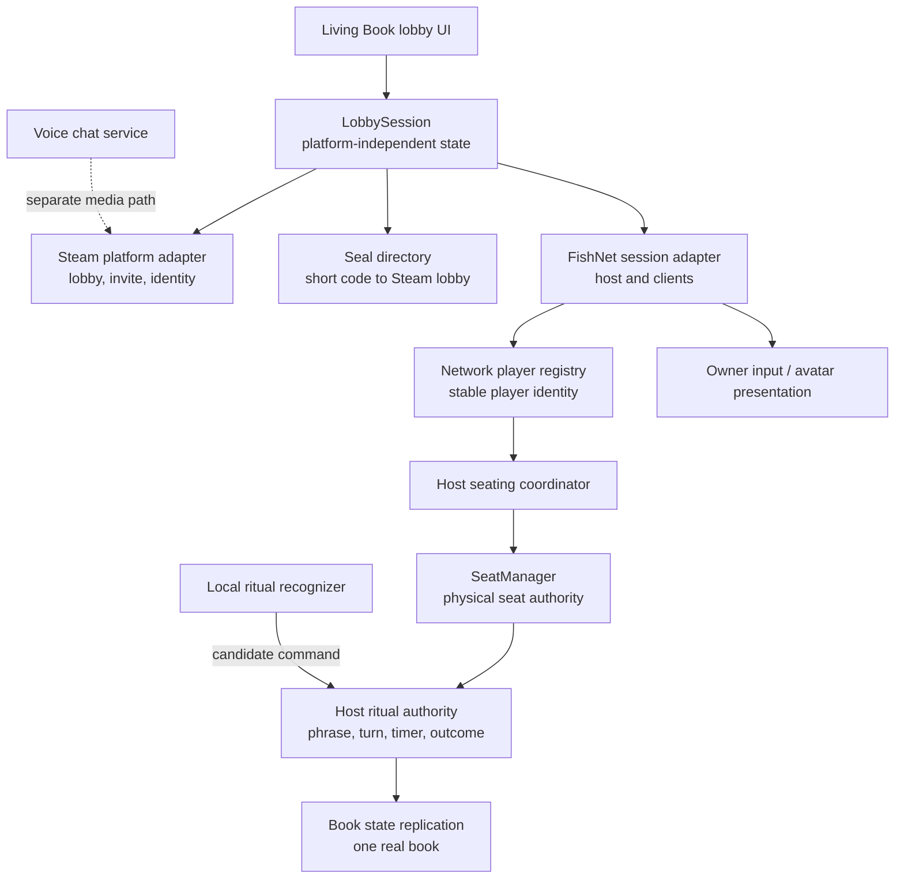

# Networking

Purpose: record the selected multiplayer framework and define the future networking architecture for Incantation.

Questions answered here:

- Which networking framework should Incantation use?
- Why was it selected over the main alternatives?
- Which state belongs to the host, each player, Steam, and local presentation?
- How should lobby creation, Seal joining, invitations, seating, voice, and ritual startup flow?
- What must a future `LobbySession` own?

This document is an architecture decision and implementation plan. It does not mean networking is installed or implemented, and it does not grant permission to modify gameplay, scenes, prefabs, or packages outside a focused networking task.

Read next: `DECISIONS.md` for the durable decision summary, `Docs/TechnicalArchitecture.md` for current system ownership, or `Docs/NEXT_TASK.md` for the active production task.

## Decision

Use **FishNet** as Incantation's future realtime networking framework.

Use a host-client topology:

- One player runs the authoritative FishNet server and also plays as a client.
- The other 1–7 players connect as clients.
- Steamworks owns Steam lobby creation, lobby discovery, invitations, Steam identity, and platform-level connection information.
- FishNet uses a compatible Steam Networking transport for game traffic.
- Voice chat remains a separate service from FishNet game-state replication and from ritual voice recognition.

Do not install FishNet, a Steamworks wrapper, a transport, or a voice package until a later implementation task explicitly scopes and validates exact package versions.

## Why FishNet

Incantation has a small player count, a single authoritative shared ritual, seated characters, and only a few important synchronized objects. It does not need shooter-scale rollback or a cloud-first session model. It needs clear authority, smooth object replication, Steam host-client support, low operational cost, and an API that can remain isolated behind game-specific services.

FishNet is the strongest fit because:

1. Its server-authoritative default matches the ritual. The host can own the book, phrase, timer, seat assignments, turn advancement, and elimination.
2. It directly supports a player acting as both server and client, which matches the requested host-client topology.
3. Its transport abstraction supports Steam transports without coupling gameplay rules to Steam APIs.
4. It provides mature object ownership, RPC, synchronized-state, prediction, and transform tools without requiring Incantation to adopt a cloud session product.
5. It is free and does not impose CCU caps or require per-player cloud networking fees.
6. Its current documentation explicitly supports Unity 6+, and the project has active releases.
7. It offers more networking headroom than Incantation presently needs while allowing a simple server-authoritative implementation.

The principal tradeoff is vendor risk: FishNet is a third-party framework with a smaller ecosystem than Unity's official stack or Mirror. Incantation should manage that risk by keeping FishNet types at the network boundary, not inside the core ritual domain.

## Framework Comparison

Assessment date: 2026-07-23. Support and licensing must be rechecked before package installation.

| Criterion | Unity Netcode for GameObjects | FishNet | Mirror | Photon Fusion |
| --- | --- | --- | --- | --- |
| Unity 6 support | Excellent and first-party. Unity positions NGO for smaller GameObject-based multiplayer games. | Explicit Unity 6+ support; actively released. | Repository explicitly lists Unity 6; actively released. | Fusion 2.1 explicitly supports Unity 6.0.x and 6.3.x. |
| Steam compatibility | Possible through community Steam transports or by using Unity Transport/Relay instead. The Steam path is not the first-party default. | Good through the transport abstraction and a compatible Steam transport such as FishySteamworks. Exact compatibility must be proven in a spike. | Good through transports such as FizzySteamworks, which Mirror documents as Steam P2P/relay capable. | Steam identity and invites can be bridged to Photon sessions, but gameplay traffic normally uses Photon Cloud rather than Steam P2P. |
| Host-client support | Native `StartHost` client-server topology. | Native server plus local client operation. | Native host server where one player is server and client. | Native Host Mode with state authority on the host. |
| Lobby support | Unity Lobby/Relay/MPS integrate well, but Steam Lobby is a separate integration. | No platform lobby service; deliberately pair with Steamworks Lobby. | No platform lobby service; deliberately pair with Steamworks Lobby. | Built-in Photon sessions/rooms, regions, and matchmaking. Steam invitations still require a bridge. |
| Learning curve | Low to moderate. Strong Unity tutorials and familiar component model. | Moderate. Broad feature set and terminology require discipline, but the server-authoritative model is clear. | Low to moderate. UNet-style Commands, RPCs, and SyncVars are widely understood. | Moderate to high. Tick simulation, state/input authority, prediction, and Photon session concepts add concepts Incantation does not currently need. |
| Performance | More than sufficient for 2–8 seated players; not the main differentiator. | Excellent headroom, efficient serialization and transform/prediction tooling; far beyond current load requirements. | Sufficient for Incantation; mature transports and serialization. | Excellent latency, prediction, interpolation, and tick simulation; optimized for substantially more demanding action games. |
| Community maturity | First-party Unity ecosystem, samples, official packages, and services. | Established and active, but smaller than Mirror and dependent on a third-party maintainer/community. | Largest and oldest open-source community in this comparison; extensive examples and integrations. | Mature commercial product with strong documentation, samples, and vendor support. |
| Long-term maintenance | Strongest engine alignment, though Unity service direction and community Steam transport compatibility remain dependencies. | Good current activity. Mitigate third-party risk through adapters and version pinning. | Strong open-source longevity and activity; API history is mature, though legacy patterns and third-party transports remain considerations. | Strong commercial maintenance, but creates Photon service, licensing, SDK, and pricing dependency. |
| Authority model | Server authority by default; owner or distributed-authority options exist. | Server authoritative by design; server assigns or transfers client ownership. | Server authoritative by default; client authority can be assigned, while synchronized state remains server controlled. | Explicit state authority and input authority; powerful but more complex. |
| Incantation fit | Very good general fit, especially if Unity Lobby/Relay replaces a Steam-native stack. Steam transport is the main weakness. | **Best fit.** Clear host authority, Steam transport path, no CCU dependency, and enough performance without cloud-first complexity. | Very good and safest open-source fallback. FishNet is preferred for its more modern networking toolset and performance headroom. | Technically excellent but disproportionate. Cloud/CCU dependency and extra simulation complexity do not buy much for a seated 2–8 player ritual. |

Performance is not a deciding factor among these options. All four can comfortably handle Incantation's expected object count and player count when implemented correctly.

## Why The Alternatives Were Not Selected

### Unity Netcode for GameObjects

NGO is the strongest alternative if first-party Unity alignment becomes more important than Steam-native networking. It fits a small GameObject game and has excellent Unity 6 support.

It was not selected because Incantation is explicitly Steam-first. NGO's official path naturally favors Unity Transport and Unity Multiplayer Services, while a Steam P2P transport depends on a community-maintained integration. This adds the same third-party transport risk as FishNet without FishNet's stronger networking feature set.

Reconsider NGO if the production plan changes to Unity Lobby plus Relay, cross-platform services become more important than Steam-native lobbies, or FishNet/Steam transport compatibility fails the required technical spike.

### Mirror

Mirror is mature, proven, free, server authoritative, and has a documented Steam P2P/relay transport path. It is the lowest-risk fallback if FishNet proves unstable in the target Unity version.

It was not selected because FishNet offers a more modern feature set, stronger performance headroom, and flexible ownership/transport tooling while preserving the same simple host-authoritative model. Incantation should not switch merely for benchmark differences; a switch would require FishNet to fail compatibility or maintainability validation.

### Photon Fusion

Fusion has the strongest advanced simulation, prediction, cloud matchmaking, and commercial support in the comparison. It supports current Unity 6 releases and Host Mode.

It was not selected because Incantation does not need its action-game simulation complexity, and its normal operating model adds Photon accounts, App IDs, cloud regions, CCU licensing, traffic planning, and a second session system beside Steam. Steam invitations can be bridged, but the result is less Steam-native and more operationally dependent than the game requires.

Reconsider Fusion if Incantation later needs cross-platform cloud matchmaking, managed global connectivity, or advanced prediction that cannot be achieved economically with the Steam/FishNet path.

## Platform And Framework Boundaries

Networking is not one system. Keep these responsibilities separate:

| Layer | Future responsibility |
| --- | --- |
| Steam platform adapter | Steam login identity, lobby create/join/leave, lobby metadata, invitations, overlay callbacks, connection endpoint, and Steam voice transport if selected. |
| Seal directory | Generate, publish, search, expire, and resolve a short human-readable Seal to one Steam lobby. |
| `LobbySession` | Platform-independent lobby member state, readiness, connection lifecycle, host role, compatibility state, and transition to ritual. |
| FishNet adapter | Start/stop host or client, connection approval, spawning, RPC/message delivery, replication, disconnect events, and network time. |
| Seating coordinator | Host-authoritative mapping from stable player identity to logical Seat; delegates physical order to `SeatManager`. |
| Ritual network authority | Host-authoritative ritual snapshot and commands for phrase, turn, book, timer, failure, retry, elimination, and end state. |
| Player presentation | Owner-generated seated pose, head/eyes/hands, mouth activity, cosmetics, and local input; replicated within strict limits. |
| Voice chat | Capture, encode, transmit, receive, mute, and playback social voice. It never validates ritual speech. |
| Ritual recognition | Local recognizer produces candidates; the host validates submitted candidates against the authoritative visible phrase and turn. |

Core gameplay code should depend on interfaces and plain data contracts. It should not depend directly on FishNet, Steamworks, Photon, Mirror, or NGO types.

## High-Level Architecture

## Future `LobbySession` Architecture

`LobbySession` should be an application-level state machine, not a UI component and not a subclass of a networking framework type.

### Responsibilities

- Own the local view of session phase: `Offline`, `Creating`, `Joining`, `InLobby`, `Connecting`, `ReadyToStart`, `Starting`, `InRitual`, `Disconnecting`, or `Failed`.
- Track stable player identity, display name, lobby membership, ready state, compatibility state, and connection state.
- Know which member is host.
- Coordinate Steam lobby membership with FishNet connection state.
- Publish immutable snapshots/events for the Living Book lobby UI.
- Accept intents such as create lobby, join by Seal, accept invite, toggle ready, leave, and host start.
- Reject invalid transitions and expose actionable failure reasons.
- Survive UI page changes without making the Book UI the source of truth.

### Non-responsibilities

- It does not choose physical seat order.
- It does not move the book.
- It does not own the ritual phrase, timer, success, failure, or elimination.
- It does not capture or validate speech.
- It does not directly animate UI, characters, or scene objects.
- It does not expose FishNet connection IDs as permanent player identity.

### Identity

Use Steam ID as the platform identity for the Steam release. Inside gameplay, wrap it in a stable `PlayerId` value so the core game is not coupled to Steam's numeric type. FishNet connection IDs are temporary routing identifiers and must never determine seat order or permanent identity.

### Compatibility Gate

Before the host accepts a player into the playable session, compare at least:

- Application build/protocol version.
- Content compatibility version.
- Supported player limit.
- Requested game mode.
- Required networking protocol version.

Reject incompatible clients before seating or spawning ritual state.

## Planned Multiplayer Flow

### Create A Lobby

1. The player selects host from the Living Book.
2. `LobbySession` requests a private or friends-only Steam lobby for 8 members.
3. Steam returns the lobby ID and makes the creator lobby owner.
4. The host generates a short random Seal and publishes its normalized value or hash in Steam lobby metadata.
5. Lobby metadata also publishes build compatibility, session phase, mode, and host connection information.
6. FishNet starts server plus local client using the validated Steam transport.
7. The host enters the pre-ritual lobby as the first member.

### Join Using A Seal

1. The player enters a case-insensitive, human-readable Seal.
2. The Seal directory queries Steam lobbies using an exact metadata filter and an appropriate distance scope.
3. Zero matches returns a clear invalid/expired message. Multiple matches must never silently choose; the host must regenerate colliding Seals or the directory must disambiguate.
4. The client checks build compatibility and lobby capacity.
5. The client joins the Steam lobby, obtains host connection data, and starts the FishNet client.
6. The host approves the connection only if Steam identity, lobby membership, protocol version, and capacity agree.
7. `LobbySession` publishes the connected member to the lobby UI.

A Seal is a convenience locator, not a password or security boundary. Steam authentication and host connection approval remain authoritative.

If Steam lobby metadata search proves too slow or unreliable for short-code lookup, replace only the Seal directory with a minimal external mapping service. Do not move lobby or gameplay authority into that service.

### Join Through Steam Invitation

1. The host opens the Steam invitation overlay for the current lobby.
2. Steam sends the lobby invitation.
3. The invitee accepts either while running or from a cold launch.
4. The Steam adapter resolves the lobby ID and hands the same join intent to `LobbySession`.
5. The flow continues through the same compatibility, membership, connection, and approval path as Seal joining.

Invitation joining and Seal joining must converge after lobby resolution; they must not become separate gameplay paths.

### Ready And Start

1. Each connected client submits a ready-state request for its own player.
2. The host validates and replicates authoritative readiness.
3. Only the host can request ritual start.
4. Start is allowed only for 2–8 connected, compatible, ready members.
5. The host seating coordinator maps the stable roster to active logical Seats.
6. `SeatManager` remains the sole owner of configured physical order. Join order and connection ID do not define traversal.
7. The host publishes a start snapshot containing roster, seat assignments, traversal direction, initial phrase seed/state, network start time, and initial ritual phase.
8. Clients acknowledge scene/readiness completion.
9. The host begins the ritual only after the required acknowledgements or an explicit timeout policy.

### Disconnect

- Before ritual start, the host removes the member, releases its seat reservation, and recomputes start eligibility.
- During ritual, the game mode decides whether the player is eliminated, temporarily disconnected, or allowed a reconnect window.
- For the first implementation, host loss ends the session gracefully and returns clients to the lobby/menu with a clear reason.
- Host migration is deferred. It requires snapshot transfer, Steam lobby ownership changes, transport reconnection, and deterministic recovery; it should not be implied by the first multiplayer milestone.

## Future Player Authority Architecture

Use host authority for shared truth and owner authority only for bounded personal input/presentation.

| State or action | Authority | Replication rule |
| --- | --- | --- |
| Steam identity and lobby membership | Steam plus host verification | Clients cannot claim another Steam ID. |
| Ready request | Owning client requests; host decides | Host replicates final ready state. |
| Seat assignment | Host | Assigned by stable roster through seating coordinator; physical order remains in `SeatManager`. |
| Character identity/cosmetics | Owner requests; host validates | Host-approved value replicated to all. |
| Seated pose, head, eyes, hands | Owning client within limits | Rate-limited owner input or pose samples; remote clients interpolate. |
| Mouth activity for chat | Owning client presentation | Replicate a small activity value or derive locally from received voice, not raw audio through FishNet. |
| Book state and destination | Host | Clients animate the one scene book from host state; never spawn one book per player. |
| Phrase and accepted-word progress | Host | Host replicates authoritative phrase snapshot/progress. |
| Turn and active Seat | Host | Host advances only after authoritative ritual result. |
| Hourglass | Host start/end network time | Clients render locally from shared network timestamps; host decides timeout. |
| Voice recognition candidate | Active owning client submits | Host checks sender, active turn, sequence, timing, and expected phrase before accepting. |
| Failure, retry, elimination, winner | Host/game mode | Host replicates decisions and reason codes. |

### Player Object Boundary

Each connected player should have one network identity object owned by that client. It represents:

- Stable player identity reference.
- Connection/session status.
- Validated display and cosmetic selections.
- Ready intent.
- Bounded seated-presentation input.
- Commands the player is permitted to request.

It must not own:

- Physical seat order.
- Shared phrase.
- Book movement.
- Timer truth.
- Turn advancement.
- Elimination decisions.

### Voice Recognition Trust Model

The active player's machine must run the current Windows keyword or optional full-phrase recognizer because microphone capture is local. The client sends normalized recognition candidates with a turn/word sequence identifier to the host. The host validates the candidate against authoritative ritual state.

This prevents a stale or non-active client from advancing the ritual, but it does not prevent a modified client from lying about recognized speech. For a social party game, that limited trust model is acceptable for the first release. Server-side audio recognition would add latency, privacy, bandwidth, and operational cost and is not justified unless cheating becomes a real problem.

## State Replication Strategy

Prefer semantic state and events over continuous transform traffic:

- Replicate book phase, target Seat, movement sequence, and authoritative start time. Let every client animate the same dramatic path locally, with correction only when needed.
- Replicate hourglass start/end network timestamps, not a timer value every frame.
- Replicate phrase version, words, accepted-word count, and validation outcome.
- Replicate seat occupancy as a stable `PlayerId` to Seat mapping.
- Replicate avatar pose at a modest rate with interpolation because players remain seated.
- Use reliable delivery for lobby state, seat assignments, phrase changes, turn results, and elimination.
- Use unreliable sequenced delivery where appropriate for frequent pose/presentation samples.
- Send late joiners or reconnecting clients a complete authoritative snapshot before incremental events.

## Failure And Security Rules

- The host validates every gameplay-changing client request.
- Never use UI state as authority.
- Never use a FishNet connection ID, join order, GameObject name, hierarchy order, or seat number sorting as physical traversal authority.
- Never expose a Seal as if it were authentication.
- Never let voice chat packets enter ritual validation.
- Never let a client move the shared book directly.
- Include sequence/version IDs so delayed RPCs cannot affect a later turn.
- Rate-limit client commands and reject malformed, duplicate, stale, or out-of-phase requests.
- Define timeouts for Steam lobby operations, network connection, scene readiness, and reconnect attempts.
- Return structured disconnect/failure reasons that the Living Book UI can explain.

## Implementation Milestones

Do not implement all networking at once.

1. **Compatibility spike:** in an isolated branch/sample, prove the exact Unity 6 version, FishNet version, Steamworks wrapper, Steam transport, two-machine connection, IL2CPP Windows build, and clean shutdown/reconnect. Do not alter gameplay during the spike.
2. **Platform lobby adapter:** create/join/leave Steam lobbies, invitations, cold-launch invite handling, metadata, and Seal lookup.
3. **Network session shell:** connect host and clients, approve identity/build/capacity, represent members, and handle disconnects.
4. **Networked `LobbySession`:** authoritative ready state and Living Book UI integration without physical ritual handoff.
5. **Authoritative seating:** map stable members to Seats through `SeatManager`.
6. **Ritual snapshot:** synchronize phrase, active Seat, timer timestamps, and the one book's semantic movement state.
7. **Player presentation:** synchronize seated avatar identity and bounded pose/mouth presentation.
8. **Voice paths:** add social voice chat separately, then route local ritual recognition candidates to host validation.
9. **Failure/reconnect hardening:** timeout, elimination, reconnect window, host-loss UX, and late snapshot recovery.
10. **Production testing:** packet loss/latency simulation, two-machine Steam testing, 2–8 player soak tests, malicious/stale command tests, and version mismatch tests.

Each milestone requires a separate focused task, documentation update, Unity validation, commit, and review.

## Validation Gate Before Installation

The framework decision is approved, but package selection is not yet approved. Before adding packages:

1. Pin exact versions rather than following floating Git branches.
2. Confirm license compatibility for FishNet, the Steamworks wrapper, and the transport.
3. Confirm all three support the project's exact Unity 6 editor version and Windows IL2CPP target.
4. Confirm the Steam transport uses current Steam Networking APIs and relay behavior.
5. Prove host, remote client, lobby invite, Seal join, disconnect, reconnect, and shutdown on two Steam accounts and two machines.
6. Record package ownership, upgrade procedure, rollback plan, and known limitations.

If the FishNet Steam spike fails, evaluate Mirror plus FizzySteamworks next. Do not silently substitute a framework.

## Sources

Primary sources reviewed for this decision:

- [Unity: choose Netcode for GameObjects for smaller GameObject-based multiplayer games](https://docs.unity.com/multiplayer/netcode/netcode)
- [Unity: Netcode for GameObjects Unity 6 tutorial and host/client setup](https://learn.unity.com/tutorial/668810b4edbc2a501c5c6d13?version=6.0)
- [Unity: Netcode for GameObjects ownership and authority](https://docs-multiplayer.unity3d.com/netcode/current/basics/ownership/)
- [FishNet: overview, server authority, host operation, and licensing position](https://fish-networking.gitbook.io/docs)
- [FishNet: Unity compatibility](https://fish-networking.gitbook.io/docs/overview/readme/features/unity-compatibility)
- [FishNet: ownership](https://fish-networking.gitbook.io/docs/guides/features/ownership)
- [FishNet: transport abstraction](https://fish-networking.gitbook.io/docs/fishnet-building-blocks/transports)
- [FishNet: official repository and releases](https://github.com/FirstGearGames/FishNet)
- [Mirror: host-server model](https://mirror-networking.gitbook.io/docs/manual/general)
- [Mirror: authority](https://mirror-networking.gitbook.io/docs/manual/guides/authority)
- [Mirror: FizzySteamworks transport](https://mirror-networking.gitbook.io/docs/manual/transports/fizzysteamworks-transport)
- [Mirror: official repository and Unity 6 support statement](https://github.com/MirrorNetworking/Mirror)
- [Photon Fusion: Unity 6 requirements and current SDK](https://doc.photonengine.com/fusion/v2/getting-started/sdk-download)
- [Photon: current CCU pricing and licensing](https://doc.photonengine.com/photon/current/pricing)
- [Steamworks: matchmaking, lobbies, metadata, invitations, authentication, and voice boundary](https://partner.steamgames.com/doc/features/multiplayer/matchmaking)

## Status

Architecture selected. Networking is not implemented. No networking packages were installed by TASK-036.
