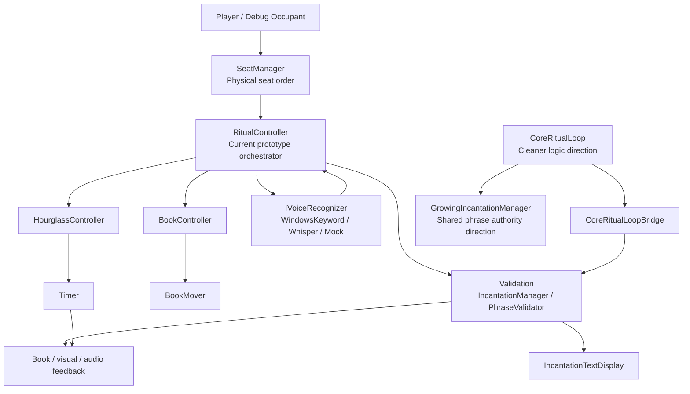

# System Diagram

This document gives a high-level map of current prototype ownership, dependencies, events, responsibilities, and extension points.

For deeper architecture notes, read `Docs/TechnicalArchitecture.md` and `Docs/CoreRitualLoopArchitecture.md`.

## High-Level Runtime Map

## Ownership

- `SeatManager` owns physical table order and occupied-seat lookup.
- `RitualController` owns current prototype orchestration.
- `BookMover` and `BookController` own movement of the one real book.
- `Timer` owns countdown state.
- `HourglassController` exposes timer pressure to ritual systems.
- `IVoiceRecognizer` implementations produce speech candidates.
- Validation systems decide whether speech candidates satisfy the visible phrase.
- `GrowingIncantationManager` is the cleaner phrase authority direction.
- `IncantationManager` still supports current display, event, and validation feedback during migration.
- `IncantationTextDisplay` displays phrase state and feedback.
- Visual and audio components react to state; they do not own gameplay authority.

## Dependencies

Current prototype dependencies:

- `RitualController` depends on `SeatManager`, book movement, hourglass, incantation, display, bridge, voice recognizer, normalizer, and word library references.
- `SeatManager` depends on configured Seat references and the single real `BookMover`.
- `BookController` depends on `BookMover`.
- `BookMover` depends on Seat book destinations.
- `HourglassController` depends on `Timer`.
- `HourglassLightPossessionController` depends on `Timer` and `FireLightFlicker`.
- `WindowsKeywordVoiceRecognizer` depends on `IncantationWordLibrary`.
- `WhisperVoiceRecognizer` depends on `WhisperManager` and `MicrophoneRecord`.
- `IncantationTextDisplay` depends on `IncantationManager` and `TMP_Text`.

## Event Flow

1. A player or debug occupant occupies a Seat.
2. `SeatManager` returns occupied seats in configured physical order.
3. `RitualController` selects the active seat.
4. `RitualController` commands the one real book to move.
5. The book reaches the active seat.
6. `RitualController` starts the hourglass.
7. `RitualController` starts the selected voice recognizer.
8. The recognizer emits a candidate word or phrase.
9. Validation checks the candidate against the current visible phrase.
10. Accepted words update phrase state and display feedback.
11. Rejected words show feedback and allow retry while time remains.
12. Accepted phrase completes the turn.
13. The hourglass stops.
14. Turn advancement updates rotation progress.
15. After a full active table rotation, one word is added.
16. The book moves to the next active seat.

## Responsibilities

`RitualController` should coordinate, not absorb every responsibility.

It may:

- Start and stop ritual attempts.
- Coordinate book, hourglass, voice, validation, display feedback, and turn advancement.
- Respect the selected validation mode.
- Prevent duplicate listeners, timers, movement, and turn resolution.

It should not:

- Own physical seat order.
- Become the phrase word library.
- Become a networking authority.
- Own visual-only references.
- Own demon reactions, cards, or lore.

## Extension Points

### Lobby

Add lobby state before networking.

Recommended handoff:

1. Lobby tracks players.
2. Ready check marks eligible players.
3. Seating service assigns ready players to physical Seats through `SeatManager`.
4. Ritual starts from occupied Seats.

### Elimination

Add elimination after retry and timeout are clear.

Recommended ownership:

- Timer signals timeout.
- Ritual resolves turn failure.
- Game mode rules decide elimination.
- Seat traversal skips eliminated players.

### Networking

Add network flow after local lobby handoff is stable.

Networking should not own phrase authority, voice validation, or physical seat order. It should synchronize state owned by the gameplay systems.

### Cards And Interference

Cards may eventually modify traversal, pressure, or social interaction.

They should not directly mutate the shared ritual phrase or move physical-order ownership out of `SeatManager`.

### Demon Reactions

Demon reactions should act as master-of-ceremonies flavor after the core loop is reliable.

They should not become required for the ritual to function.

## Anti-Patterns

Avoid:

- Multiple gameplay books.
- Walking characters.
- Phrase growth after each player.
- Seat traversal from hierarchy order.
- Gameplay scripts on `BookGhost`.
- UI owning phrase authority.
- Voice recognizers deciding success.
- Networking transport deciding ritual rules.
- Cards directly changing the ritual phrase.
- Demon reactions driving core progression before the loop is stable.
