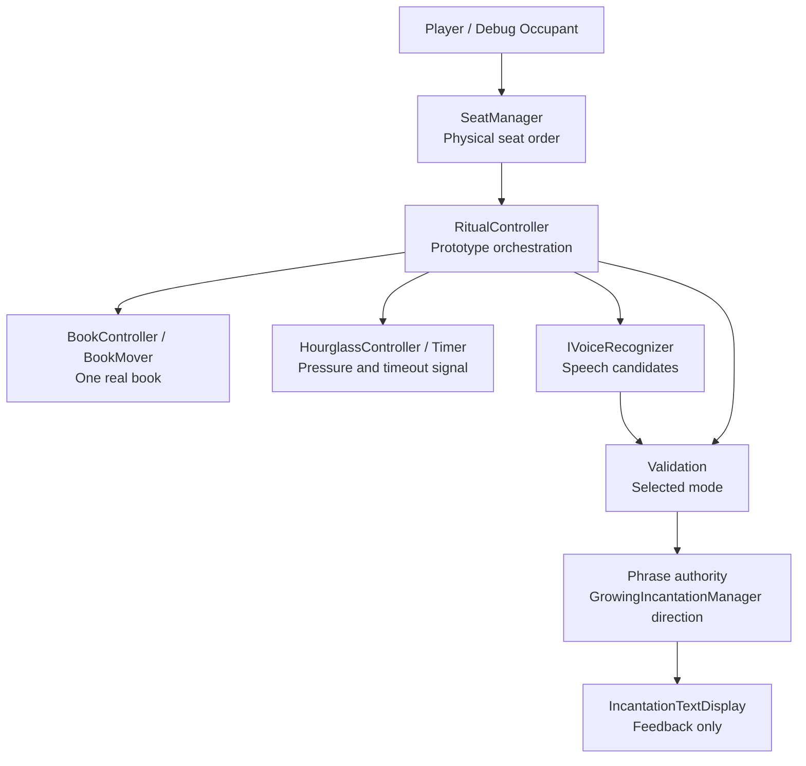

# Technical Architecture

This document defines current technical ownership and architecture boundaries.

Purpose: help contributors change systems without moving authority into the wrong place.

Questions answered here:

- Which systems own gameplay authority?
- Which objects are visual-only?
- What is the current runtime migration state?
- What boundaries must architecture changes preserve?

This document does not contain gameplay law, current task planning, historical milestone memory, or complete code-level reference.

Read next: `Docs/PROJECT_KNOWLEDGE.md` for the detailed code map, or a focused system document for the system being changed.

## Current Priority

Priority 1 is the clean core ritual loop and reliable voice interaction.

The current prototype is a local playable ritual slice. Lobby is the next major milestone. The FishNet connection foundation and permanent NetworkPlayer data boundary exist, but gameplay networking is not implemented.

## Architecture Boundaries

- Prefer extending existing systems over creating new ones.
- Keep gameplay logic out of visual-only objects.
- Keep the Seat system logical and the chair visual.
- `SeatManager` owns the configured physical seating order around the table.
- Keep `BookGhost` as a visual placement reference only.
- Keep one real gameplay book.
- Keep `SpellPhraseLibrary` separate from ritual words.
- Treat `WhisperSandbox` as sandbox/reference code unless explicitly asked to change it.
- Do not make characters walk around.

## Current Prototype Systems

### Lobby Player State

`NetworkPlayer` is the permanent per-connection source of player identity and shared player state. FishNet supplies its `Connection`, `Owner`, and local ownership status. The component replicates high-priest role, priest name, lobby lifecycle state, ready state, and Seat ID; it exposes change events and server-only mutation APIs. Character customization ID remains an unsynchronized data boundary until its focused networking task.

`NetworkPlayer.SeatId` is the single authoritative multiplayer Seat assignment. Owners submit
Seat requests to the server; the server rejects an ID already assigned to another active
player and replicates accepted changes. `SeatManager` derives stable zero-based IDs from the
configured clockwise physical Seat list, resolves a Seat occupant through active
`NetworkPlayer` instances, and refreshes Seat availability presentation.
Authoritative ritual roster construction does not consume that presentation-oriented global
lookup. On the server it enumerates FishNet's live authenticated connections, requires exactly
one initialized owned `NetworkPlayer` for each, validates stable `PlayerId` and synchronized
`SeatId`, then orders the validated players through `SeatManager`'s physical Seat list.
`NetworkCharacterPresentation` is a one-to-one observer attached to the NetworkPlayer prefab.
On each client it binds exactly one visual character to its observed player, resolves the
local scene character only for the owning player, creates an independent visual instance for
each non-owner, and moves or releases only that character when Seat ID changes or the player
disconnects. `Seat.currentPlayer` and `Seat.isOccupied` remain only as backward-compatible
offline/debug and runtime visual bindings. They must not be used as a second network
occupancy authority.

`LobbyPlayerStateController` temporarily remains the local lobby transition authority used by the current Living Book flow. It is not a second permanent player model and must be adapted to read/write `NetworkPlayer` in a later lobby-networking task. `NetworkPlayer` does not render UI, select a Seat, move the Book, control a character, or run ritual gameplay.

The current v0.1 prototype includes:

- `RitualController` as the current prototype ritual orchestration surface.
- `SeatManager` for physical seat traversal and book routing.
- `BookMover` and book helpers for moving the one real book.
- `IncantationManager` and core ritual phrase systems for phrase state and word acceptance.
- `VoicePhraseNormalizer` for phrase and word normalization.
- `WindowsKeywordVoiceRecognizer` for realtime keyword recognition.
- `WhisperVoiceRecognizer` for Whisper-based recognition paths.
- `NetworkRitualAuthority` for network timer truth, with `HourglassController` retaining the
  offline countdown and acting as the network presentation/compatibility bridge.
- `NetworkPlayer` as the connection-owned ritual voice-submission ingress, with
  `NetworkRitualAuthority` authenticating input, exclusively judging it with the existing
  deterministic phrase rules, committing the official turn outcome, and selecting its one
  authoritative consequence. `RitualController` temporarily applies immutable validation and
  consequence snapshots to legacy presentation.
- Lighting and ambience components for fire flicker, hourglass light possession, room veil, and cabin atmosphere.

For a visual overview of ownership, dependencies, events, and extension points, read `Docs/SYSTEM_DIAGRAM.md`.

## High-Level System Diagram

## Runtime Migration State

The project is in an incremental migration, not a completed rewrite.

`RitualController` is still the working prototype runtime surface. It coordinates seats, book movement, hourglass timing, voice listening, incantation display, validation mode handling, retry behavior, and successful turn advancement.

`CoreRitualLoop` is the cleaner logic direction. It coordinates `TurnManager`, `GrowingIncantationManager`, and `PhraseValidator`, but it does not know about scene visuals, the book transform, the hourglass, voice recognizer implementations, networking, or UI.

`CoreRitualLoopBridge` adapts the newer core phrase path into the legacy `IncantationManager` model while UI and feedback still depend on it.

Do not assume newer core-loop scripts have replaced the current prototype runtime. Prefer incremental migration that keeps Play Mode working.

In a FishNet ritual, raw recognized speech follows one path:
`IVoiceRecognizer` -> `RitualController` -> locally owned `NetworkPlayer` server RPC ->
`NetworkRitualAuthority` validation -> `RitualController` legacy result application. The submitted
contract contains stable sequence values and text, never a trusted player ID. The server derives
identity from the RPC connection and rejects candidates that do not belong to the current active
participant, accepted Book arrival, and running timer window. Offline sessions bypass this bridge
and preserve direct evaluation and application through the same `PhraseValidator`.

Official network turn completion is a separate authority boundary. Phrase-completing validation
and authoritative timer expiration converge inside `NetworkRitualAuthority`, which commits
exactly one immutable `TurnOutcomeSnapshot` for the current ritual, turn, and active player.
Locking the first authoritative roster begins the runtime ritual lifecycle by advancing the
ritual sequence from zero and legally transitioning `Inactive` to `Preparing`. This must happen
before active-participant, Book, timer, validation, outcome, or consequence records are created;
sequence zero is reserved for unavailable/uninitialized ritual state. Detailed phase progression
beyond `Preparing` remains on the documented legacy bridge until that focused migration.
The outcome contains stable source sequence IDs and no Unity references. The authority validates
the current ritual, turn, player, and originating outcome before committing exactly one
`RitualConsequenceSnapshot`. `RitualController` reacts only to that consequence through its
existing success or timeout compatibility pipeline. Book movement, Seat changes, elimination,
Book Prison, next-turn selection, and phase progression remain legacy execution awaiting later
migration or bridge removal.

## Final Multiplayer Ritual Authority Ownership

`NetworkRitualAuthority` is the only multiplayer gameplay writer for the migrated ritual
decisions. The final ownership review is:

| Decision | Sole authoritative writer | Other participants |
| --- | --- | --- |
| Roster and ritual entry | `NetworkRitualAuthority.TryBuildRosterFromCurrentSeating` | FishNet's authenticated server connections resolve exactly one owned `NetworkPlayer` each; stable player/Seat identity is then ordered through `SeatManager`. The first validated lock advances the ritual sequence and transitions `Inactive` to `Preparing`. |
| Active participant | `NetworkRitualAuthority.TryCommitNextActiveParticipant` | `RitualController` supplies its legacy requested Seat as a validated expectation but cannot write participant state. |
| Book command | `NetworkRitualAuthority.TryRequestBookMoveToCurrentParticipant` | `BookMover` adapts legacy requests; `NetworkBookAuthority` executes the accepted command. |
| Book arrival | `NetworkRitualAuthority.TryCommitBookArrival` | `NetworkBookAuthority` detects completion and submits a stable-data report. |
| Timer | `NetworkRitualAuthority` timer start, stop, and expiration paths | `RitualController.hourglassDuration` supplies the one offline/network duration configuration. `HourglassController` and `Timer` present snapshots and forward a server stop request. |
| Voice submission acceptance | `NetworkRitualAuthority.TryAcceptVoiceSubmission` | The recognizer supplies local input; the owning `NetworkPlayer` authenticates transport. |
| Phrase validation | `NetworkRitualAuthority` deterministic validation commit | `IncantationManager` supplies the server phrase and applies immutable results for presentation. |
| Turn outcome | `NetworkRitualAuthority.TryCommitTurnOutcome` | Validation and timer state are immutable originating evidence only. |
| Consequence | `NetworkRitualAuthority.TryCommitConsequence` | `RitualController` executes the published compatibility/presentation sequence. |

All synchronized fields for these decisions are private to `NetworkRitualAuthority`. Public
consumers receive immutable snapshots, read-only queries, or events. Client-to-server voice
transport is the only client request in this decision chain; sender identity is derived from the
FishNet connection and clients cannot call a commit path.

### Compatibility Boundaries That Intentionally Remain

- `RitualController` remains the offline gameplay orchestrator and the network presentation/
  execution coordinator. It owns local voice-listening lifecycle, retry feedback, phrase replay,
  Book acceptance timing, failure visuals, absorption handoff, and the existing prototype
  elimination/next-turn execution. During a network session it cannot validate speech, expire
  time, commit an outcome, or choose a consequence.
- An authoritative timeout consequence carries its stable `PlayerId` into
  `RitualController.CurrentFailedPlayerId` for the duration of the legacy failure presentation.
  `BookPrisonSpectatorController` resolves that exact ID to a `NetworkPlayer` and activates the
  prison camera only when that object reports `IsOwner`. Seat transforms, character-presentation
  hierarchy, host role, and current active Seat are not camera-ownership evidence. Remote peers
  still run the shared prison and aftermath visuals; they only ignore the local camera switch.
  The gameplay camera is part of the scene character prefab, so its world pose must also be
  protected from indirect ancestor movement. During a remote elimination, the absorption and
  Book Prison root-movement boundaries preserve every active local camera's world position and
  rotation. The eliminated character still moves, shrinks, disappears, and enters its prison
  slot on every peer; only locally owned elimination may carry the local viewpoint with it.
- `BookMover.MoveToSeat` remains the shared offline/network call surface. Offline it executes the
  original interpolation. In a network session it converts the requested `Seat` to a stable ID
  and forwards it to ritual authority as an expectation; it cannot issue a network movement
  command. `MoveToSeatAuthoritatively` remains the execution entry used by
  `NetworkBookAuthority` and the offline path.
- `NetworkBookAuthority` remains transport authority for the one physical Book. It resolves an
  accepted stable Seat ID, runs interpolation, synchronizes pose/state, and reports completion;
  it never selects the participant or destination. Its invisible proxy is aligned to the visible
  Book during `Awake`, before FishNet initializes or captures scene-object transform state. A
  joining client therefore cannot apply the proxy's serialized origin pose to `BookModel`.
  Proxy active state is never copied to the visible Book.
- `HourglassController` and `Timer` remain necessary because the existing scene, UI, audio, and
  UnityEvents consume them. Their local countdown is enabled only offline. Network sessions apply
  authoritative snapshots and never compute gameplay expiration.
- `IncantationManager` remains the offline phrase/validation implementation and the network phrase
  presentation model. Its local evaluation methods are reached only by offline flow; network
  recognition returns after submitting to `NetworkRitualAuthority`, then applies the immutable
  server result.
- The focused `Committed` events preserve immediate presentation, while matching snapshot-change
  events restore state for late or re-enabled consumers. Sequence guards make the dual delivery
  idempotent; neither event is a second writer.

These bridges are not orphaned: each has a current caller or serialized scene consumer. Removing
them now would change offline play, Book movement presentation, timer UI/events, phrase replay,
or failure presentation and is therefore outside architecture cleanup.

## Network Scene Startup

`Assets/Scenes/Bootstrap.unity` is a networking launcher, not a gameplay scene. The
persistent `IncantationNetworkManager` starts FishNet there. On the first server Started
event of a network lifecycle, `FishNetFoundationController` loads `MainGame` as a FishNet
global scene with `ReplaceOption.All`. FishNet synchronizes that scene to the host client,
current remote clients, and later joiners. The one-request guard resets only when the server
stops. Gameplay code must not manually load `MainGame` with Unity's `SceneManager`.

For a detailed code map and known migration tensions, read `Docs/PROJECT_KNOWLEDGE.md`.

## Physical Seat Order

The cursed book advances according to the configured physical seating order, not according to GameObject names, seat numbers, hierarchy order, player join order, or network player index.

The Core Ritual Engine must never assume sequential numbering.

The current prototype clockwise order is:

1. Seat1
2. Seat5
3. Seat3
4. Seat6
5. Seat2
6. Seat7
7. Seat4
8. Seat8

Counter-clockwise traversal is the exact reverse.

Traversal rules may later be temporarily changed by spell-card effects such as reverse rotation, random next player, skip occupied seat, or double jump. Those effects modify traversal behavior; they do not move ownership of physical order out of the Seat system.

Debug occupants are for local testing only and should be replaced by lobby and networking flow later.

## Voice Architecture

The project currently supports two validation modes:

- `WordByWordRealtime`: default prototype mode using immediate keyword recognition for visible word-by-word acceptance.
- `FullPhrase`: optional strict mode using full phrase transcript validation.

`WindowsKeywordVoiceRecognizer` is currently preferred for realtime prototype gameplay.

Whisper remains available for full-phrase or experimental recognition paths and should not be removed, but it should not be forced as the only validation path.

Unity Dictation and Azure are not part of the current project plan.

## Phrase Ownership

The ritual phrase:

- Starts with 1 word.
- Is shared by all active players.
- Grows by 1 word after a full active table rotation.
- Does not grow after each individual player.
- Does not fork per player.
- Must remain separate from `SpellPhraseLibrary`.

## Paused Systems

Notebook, cards, lore, demon reactions, campaign objectives, assets, scenes, prefabs, and networking should not be changed during core ritual tasks unless explicitly requested.
