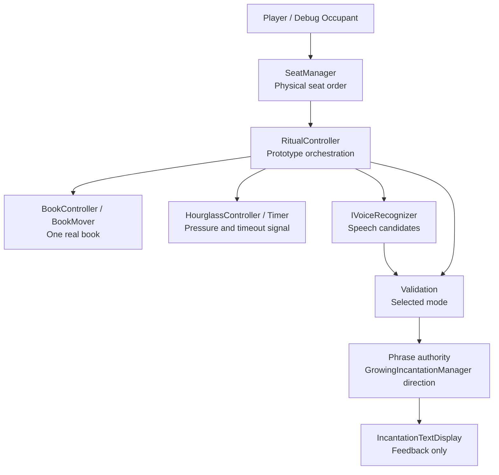

# Technical Architecture

This document defines current technical ownership and architecture boundaries.

Purpose: help contributors change systems without moving authority into the wrong place.

Questions answered here:

- Which systems own gameplay authority?
- Which objects are visual-only?
- What is the current runtime migration state?
- What boundaries must architecture changes preserve?

This document does not contain gameplay law, current task planning, historical milestone memory, or complete code-level reference.

Read next: `Docs/PROJECT_KNOWLEDGE.md` for the detailed code map, or a focused system document for the system being changed.

## Current Priority

Priority 1 is the clean core ritual loop and reliable voice interaction.

The current prototype is a local playable ritual slice. Lobby is the next major milestone. The FishNet connection foundation and permanent NetworkPlayer data boundary exist, but gameplay networking is not implemented.

## Architecture Boundaries

- Prefer extending existing systems over creating new ones.
- Keep gameplay logic out of visual-only objects.
- Keep the Seat system logical and the chair visual.
- `SeatManager` owns the configured physical seating order around the table.
- Keep `BookGhost` as a visual placement reference only.
- Keep one real gameplay book.
- Keep `SpellPhraseLibrary` separate from ritual words.
- Treat `WhisperSandbox` as sandbox/reference code unless explicitly asked to change it.
- Do not make characters walk around.

## Current Prototype Systems

### Lobby Player State

`NetworkPlayer` is the permanent per-connection source of player identity and shared player state. FishNet supplies its `Connection`, `Owner`, and local ownership status. The component replicates high-priest role, priest name, lobby lifecycle state, ready state, and Seat ID; it exposes change events and server-only mutation APIs. Character customization ID remains an unsynchronized data boundary until its focused networking task.

`NetworkPlayer.SeatId` is the single authoritative multiplayer Seat assignment. Owners submit
Seat requests to the server; the server rejects an ID already assigned to another active
player and replicates accepted changes. `SeatManager` derives stable zero-based IDs from the
configured clockwise physical Seat list, resolves a Seat occupant through active
`NetworkPlayer` instances, and refreshes Seat availability presentation.
Authoritative ritual roster construction does not consume that presentation-oriented global
lookup. On the server it enumerates FishNet's live authenticated connections, requires exactly
one initialized owned `NetworkPlayer` for each, validates stable `PlayerId` and synchronized
`SeatId`, then orders the validated players through `SeatManager`'s physical Seat list.
`NetworkCharacterPresentation` is a one-to-one observer attached to the NetworkPlayer prefab.
On each client it binds exactly one visual character to its observed player, resolves the
local scene character only for the owning player, creates an independent visual instance for
each non-owner, and moves or releases only that character when Seat ID changes or the player
disconnects. `Seat.currentPlayer` and `Seat.isOccupied` remain only as backward-compatible
offline/debug and runtime visual bindings. They must not be used as a second network
occupancy authority.

`NetworkGhostPresentation` is another one-to-one presentation observer on that same persistent
`NetworkPlayer`; it does not create a second player identity or dead-state authority. The existing
`NetworkRitualAuthority` roster remains the sole synchronized alive/eliminated truth. The owner may
publish Ghost readiness only for its own NetworkPlayer at the existing timeout consequence/Book
Prison presentation barrier, and may publish pose only after the roster marks that player dead.
Each process reuses the authored Ghost for its local owner and instantiates the committed
`GhostModel` for every remote eliminated player. Only world position and body yaw travel at the
configured lightweight pose cadence; remote instances interpolate and never enable movement,
Camera, or AudioListener components. No observer condition hides Ghosts from living players, so
Alive-to-Ghost, Ghost-to-Alive, and Ghost-to-Ghost visibility are all intentional. Completed-match
return clears Ghost presentation before normal character Seat presentation is reapplied. Voice
routing remains independent future DEATH-002 work.

`NetworkSpellHand` is a narrow server-owned inventory attached to the same persistent player
identity. Its only lifecycle input is the read-only `NetworkRitualAuthority.Snapshot`: ritual
sequence starts a fresh match hand, the existing authoritative player-turn sequence owns
refill/reset idempotence, the roster owns alive eligibility, and the correlated accepted physical
Book arrival owns the Book lock. It never chooses a Seat, moves the Book, changes a Timer,
eliminates a player, or resolves an effect.

Each private `SpellCardInstance` carries a monotonically allocated instance ID and normalized
`SpellDefinition` ID. The owner-only synchronized list contains no Unity object references. The
owner maps IDs back to the serialized definition pool and sends a three-slot presentation contract
to `SpellHandController`; empty slots remain hidden and animation stays local. An open hand keeps
its raised pose across authoritative content changes. Surviving instances retain their physical
views while compacting into new raised slots, and the consumed view stays hidden. The local spell
input context reserves E during an active living hand, so `NotebookInput` yields instead of also
toggling. Correlated Book arrival closes raised cards, cancels spell capture, releases only the
Spell Hand context, and prevents reopening. Remote character copies have their Spell Hand debug
input disabled.

`SpellVoiceCastController` is the local complete-attempt adapter for the existing production
`WhisperVoiceRecognizer`; it never owns inventory. The enabled Camera under the owning local
character casts a center-view gaze ray only against that hand's three card-renderer bounds.
Short dwell and look-away grace select zero or one authoritative slot without mouse-position or
numeric runtime input. The selected private authoritative card instance remains the attempt
identity across presentation-only hand refreshes. Real gaze selection of another card, gaze loss,
or loss of the captured instance cancels the attempt rather than mutating its identity.
The shared recognizer records an explicit Spell or Ritual capture purpose and delivers the complete
transcript only through that purpose's event. One complete transcript is normalized without fuzzy matching, and a
nonce-bearing request crosses the owning `NetworkSpellHand` ServerRpc. `NetworkSpellHand`
revalidates sender, lifecycle, instance/definition identity, unused-this-turn state, correlated
Book absence, and the definition's canonical or explicitly accepted phrase before removing that
exact instance. A targeted result drives the existing consumption animation. Failed requests do
not mutate the hand, while Book/turn/match invalidation cancels the local recognizer session so an
in-flight result cannot submit. No spell effect or target is resolved in this milestone.
The ritual controller's existing listening entry point invokes only the spell controller's local
release hook before acquiring the same recognizer; this is microphone arbitration, not a second
recognizer or a change to ritual validation.
The initial three-entry pool is also the initial-hand ordering contract: match initialization adds
each unique serialized definition once, while subsequent single-card refills continue through the
existing server-random grant method. This is a Development content constraint, not a general deck
or no-duplicate architecture.

`LobbyPlayerStateController` temporarily remains the local lobby transition authority used by the current Living Book flow. It is not a second permanent player model and must be adapted to read/write `NetworkPlayer` in a later lobby-networking task. `NetworkPlayer` does not render UI, select a Seat, move the Book, control a character, or run ritual gameplay.

The current v0.1 prototype includes:

- `RitualController` as the current prototype ritual orchestration surface.
- `SeatManager` for physical seat traversal and book routing.
- `BookMover` and book helpers for moving the one real book.
- `IncantationManager` and core ritual phrase systems for phrase state and word acceptance.
- `VoicePhraseNormalizer` for phrase and word normalization.
- `WindowsKeywordVoiceRecognizer` for realtime keyword recognition.
- `WhisperVoiceRecognizer` for Whisper-based recognition paths.
- `NetworkRitualAuthority` for network timer truth, with `HourglassController` retaining the
  offline countdown and acting as the network presentation/compatibility bridge.
- `NetworkPlayer` as the connection-owned ritual voice-submission ingress, with
  `NetworkRitualAuthority` authenticating input, exclusively judging it with the existing
  deterministic phrase rules, committing the official turn outcome, and selecting its one
  authoritative consequence. `RitualController` temporarily applies immutable validation and
  consequence snapshots to legacy presentation.
- Lighting and ambience components for fire flicker, hourglass light possession, room veil, and cabin atmosphere.

For a visual overview of ownership, dependencies, events, and extension points, read `Docs/SYSTEM_DIAGRAM.md`.

## High-Level System Diagram

## Runtime Migration State

The project is in an incremental migration, not a completed rewrite.

`RitualController` is still the working prototype runtime surface. It coordinates seats, book movement, hourglass timing, voice listening, incantation display, validation mode handling, retry behavior, and successful turn advancement.

`CoreRitualLoop` is the cleaner logic direction. It coordinates `TurnManager`, `GrowingIncantationManager`, and `PhraseValidator`, but it does not know about scene visuals, the book transform, the hourglass, voice recognizer implementations, networking, or UI.

`CoreRitualLoopBridge` adapts the newer core phrase path into the legacy `IncantationManager` model while UI and feedback still depend on it.

Do not assume newer core-loop scripts have replaced the current prototype runtime. Prefer incremental migration that keeps Play Mode working.

In a FishNet ritual, raw recognized speech follows one path:
`IVoiceRecognizer` -> `RitualController` -> locally owned `NetworkPlayer` server RPC ->
`NetworkRitualAuthority` validation -> `RitualController` legacy result application. The submitted
contract contains stable sequence values and text, never a trusted player ID. The server derives
identity from the RPC connection and rejects candidates that do not belong to the current active
participant, accepted Book arrival, and running timer window. Offline sessions bypass this bridge
and preserve direct evaluation and application through the same `PhraseValidator`.

Official network turn completion is a separate authority boundary. Phrase-completing validation
and authoritative timer expiration converge inside `NetworkRitualAuthority`, which commits
exactly one immutable `TurnOutcomeSnapshot` for the current ritual, turn, and active player.
Locking the first authoritative roster begins the runtime ritual lifecycle by advancing the
ritual sequence from zero and legally transitioning `Inactive` to `Preparing`. This must happen
before active-participant, Book, timer, validation, outcome, or consequence records are created;
sequence zero is reserved for unavailable/uninitialized ritual state. Detailed phase progression
beyond `Preparing` remains on the documented legacy bridge until that focused migration.
The outcome contains stable source sequence IDs and no Unity references. The authority validates
the current ritual, turn, player, and originating outcome before committing exactly one
`RitualConsequenceSnapshot`. `RitualController` reacts only to that consequence through its
existing success or timeout compatibility pipeline. Book movement, Seat changes, elimination,
Book Prison, next-turn selection, and phase progression remain legacy execution awaiting later
migration or bridge removal.

## Multiplayer Ritual Authority Boundary

`NetworkRitualAuthority` is the intended sole multiplayer gameplay orchestrator and the only
writer for the migrated ritual decisions. `RitualController.StartRitual()` is presentation-only
in an active FishNet session and never starts the legacy `RitualLoop`; offline play still starts
that loop unchanged. The current ownership review is:

| Decision | Sole authoritative writer | Other participants |
| --- | --- | --- |
| Roster and ritual entry | `NetworkRitualAuthority.TryBuildRosterFromCurrentSeating` | FishNet's authenticated server connections resolve exactly one owned `NetworkPlayer` each; stable player/Seat identity is then ordered through `SeatManager`. The first validated lock advances the ritual sequence and transitions `Inactive` to `Preparing`. |
| Active participant | `NetworkRitualAuthority.TryCommitNextActiveParticipant` | Network start selects the first participant from the authoritative roster. A peer's locally selected lobby Seat is never used as the network starting participant. |
| Book command | `NetworkRitualAuthority.TryRequestBookMoveToCurrentParticipant` | `BookMover` adapts legacy requests; `NetworkBookAuthority` executes the accepted command. |
| Book arrival | `NetworkRitualAuthority.TryCommitBookArrival` | `NetworkBookAuthority` detects completion and submits a stable-data report. |
| Timer | `NetworkRitualAuthority` timer start, stop, and expiration paths | `RitualController.hourglassDuration` supplies the one offline/network duration configuration. `HourglassController` and `Timer` present snapshots and forward a server stop request. |
| Voice submission acceptance | `NetworkRitualAuthority.TryAcceptVoiceSubmission` | The recognizer supplies local input; the owning `NetworkPlayer` authenticates transport. |
| Phrase validation | `NetworkRitualAuthority` deterministic validation commit | `IncantationManager` supplies the server phrase and applies immutable results for presentation. |
| Turn outcome | `NetworkRitualAuthority.TryCommitTurnOutcome` | Validation and timer state are immutable originating evidence only. |
| Consequence | `NetworkRitualAuthority.TryCommitConsequence` | `RitualController` executes the published compatibility/presentation sequence. |

All synchronized fields for these decisions are private to `NetworkRitualAuthority`. Public
consumers receive immutable snapshots, read-only queries, or events. Client-to-server voice
transport is the only client request in this decision chain; sender identity is derived from the
FishNet connection and clients cannot call a commit path.

### Compatibility Boundaries That Intentionally Remain

- `RitualController` remains the offline gameplay orchestrator. During a network ritual it is a
  presentation/compatibility consumer and its legacy `RitualLoop` is not started on either Host
  or remote Client. Its authoritative validation and consequence subscriptions remain intact.
- An authoritative timeout consequence carries its stable `PlayerId` into
  `RitualController.CurrentFailedPlayerId` for the duration of the legacy failure presentation.
  `BookPrisonSpectatorController` resolves that exact ID to a `NetworkPlayer` and activates the
  prison camera only when that object reports `IsOwner`. Seat transforms, character-presentation
  hierarchy, host role, and current active Seat are not camera-ownership evidence. Remote peers
  still run the shared prison and aftermath visuals; they only ignore the local camera switch.
  A camera whose Transform is the moved character root or a descendant of it has its world pose
  protected from indirect ancestor movement. During a remote elimination, the absorption and
  Book Prison root-movement boundaries preserve only those structurally affected cameras. They
  never rewrite an unrelated survivor, menu, scene, or Death Camera. The eliminated character
  still moves, shrinks, disappears, and enters its prison slot on every peer; only locally owned
  elimination may carry the local viewpoint with it.
- `BookMover.MoveToSeat` remains the shared offline/network call surface. Offline it executes the
  original interpolation. In a network session it converts the requested `Seat` to a stable ID
  and forwards it to ritual authority as an expectation; it cannot issue a network movement
  command. `MoveToSeatAuthoritatively` remains the execution entry used by
  `NetworkBookAuthority` and the offline path.
- `NetworkBookAuthority` remains transport authority for the one physical Book. It resolves an
  accepted stable Seat ID, runs interpolation, synchronizes pose/state, and reports completion;
  it never selects the participant or destination. Its invisible proxy is aligned to the visible
  Book during `Awake`, before FishNet initializes or captures scene-object transform state. A
  joining client therefore cannot apply the proxy's serialized origin pose to `BookModel`.
- Book presentation authority is lifecycle-scoped. Menu, Circle, seated customization, and
  Character view use the existing visible Book as local-only presentation on each process;
  `NetworkBookAuthority.LateUpdate` does not synchronize pose in that mode. Before ritual start,
  the Host reconciles the visible Book and proxy to the authored lobby pose and all authorized
  peers enter shared mode. Ritual movement, arrival, game-over presentation, and the post-game
  server reset continue through the existing authoritative command paths.
  Proxy active state is never copied to the visible Book.
- `HourglassController` and `Timer` remain necessary because the existing scene, UI, audio, and
  UnityEvents consume them. Their local countdown is enabled only offline. Network sessions apply
  authoritative snapshots and never compute gameplay expiration. FishNet's synchronized
  approximate server clock, `TimeManager.TicksToTime(TickType.Tick)`, is used explicitly for
  authoritative deadline creation, reconstruction, and expiration on every peer. The default
  `LocalTick` domain must not be used because its origin is local to each process.
  `Timer` retains the authoritative timer sequence and expired state so a late or re-enabled
  `HourglassVisualController` immediately renders the current state instead of resetting to full.
  An expired snapshot always forces zero remaining time and terminal sand, while a new timer
  sequence resets the visual duration from the authoritative duration. The hourglass presentation
  keeps each pile's authored horizontal footprint, changes height along the model's local Z axis,
  and compensates position to anchor the upper pile at the neck and the lower pile at its base.
  TopSand may narrow its authored X/Y footprint only during its configurable late depletion phase;
  this does not participate in height or anchor calculations and is not applied to BottomSand.
  An optional falling-sand Transform is active only while the Timer is running with time remaining.
  Stopped, reset, and inactive non-expired timer states show the authored ready presentation.
- `IncantationManager` remains the offline phrase/validation implementation and the network phrase
  presentation model. Its local evaluation methods are reached only by offline flow; network
  recognition returns after submitting to `NetworkRitualAuthority`, then applies the immutable
  server result.
- The focused `Committed` events preserve immediate presentation, while matching snapshot-change
  events restore state for late or re-enabled consumers. Sequence guards make the dual delivery
  idempotent; neither event is a second writer.

These bridges are not orphaned: each has a current caller or serialized scene consumer. Removing
them now would change offline play, Book movement presentation, timer UI/events, phrase replay,
or failure presentation and is therefore outside architecture cleanup.

### Authoritative Turn And Phrase Lifecycle

Network start locks the roster, initializes exactly one phrase word from the configured
`GrowingIncantationManager` vocabulary, selects the first participant, and issues the first Book
command. Book arrival transitions the authority to `AwaitingRecitation` and starts the server
timer. Only the locally owned `NetworkPlayer` whose stable `PlayerId` equals the authoritative
`ActivePlayerId` enables ritual recognition and submits recognized text.

Successful validation transitions `AwaitingRecitation -> ResolvingTurn`. After publishing the
success consequence, `NetworkRitualAuthority` selects the next eligible roster entry itself. A
physical rotation completes only when that ordered traversal wraps past the end of the locked
roster; the authority then transitions through `CompletingRotation`, increments
`CompletedRotationCount`, and appends exactly one word before entering `BookMoving` for the next
turn. No `RitualController` coroutine participates in this progression.

Timeout transitions to `ResolvingTurn` and publishes the existing failure consequence. The
absorption, aftermath, and Book Prison sequence remains a presentation barrier. When it finishes,
the Host-side `RitualController` adapter submits only the committed ritual, turn, and consequence
sequences to `NetworkRitualAuthority`; remote adapters clear local failure-presentation state.
The authority validates the current timeout, derives the failed identity from server state, and
updates the existing fixed roster entry in place with `IsActive=false` and `IsAlive=false`.
With multiple survivors it reuses the normal next-eligible physical traversal and wrap result,
so phrase growth remains exactly once per surviving-table wrap. With one survivor it clears the
active participant, stops turn state, stores the stable string winner Player ID, sets game over,
and transitions to `Completed`. Local `SeatManager` elimination remains offline-only.

`NetworkGameOverPresentationController` is a read-only presentation consumer of that completed
snapshot. It resolves the synchronized winner against `NetworkPlayer.ActivePlayers` by ordinal
stable `PlayerId`. Only its server instance may request `NetworkBookAuthority`'s explicit winner
presentation movement. That movement reuses `BookMover` and the existing server-owned transform
proxy, but uses separate session, ritual, winner, and presentation-sequence state and a separate
completion coroutine. It never constructs `RitualBookArrivalReport` or calls
`TryCommitBookArrival`. Result UI is local presentation derived from the same snapshot; it does
not count survivors or choose a winner.

`NetworkPlayer.RequestReturnToLobby` is the authenticated Host request boundary for post-game
reset. The server accepts it only from the listen Host while the ritual is completed/game-over.
`NetworkRitualAuthority.TryResetCompletedRitualToLobby` performs the sole match-state mutation:
it transitions to `Inactive`, clears the fixed ritual roster and all match-scoped outcome,
phrase, timer, voice, validation, consequence, and target associations, and preserves monotonic
gameplay Book movement identity. Current Circle players retain connection identity, membership,
name, and appearance, but return to `NotReady`, `LobbyPlayerState.NotSeated`, and an unassigned
Seat. Existing synchronized Seat observers free network presentation occupancy; the local owner
is moved to the configured lobby waiting transform and remote unseated clones remain hidden.
`NetworkPostGameLifecycleController` reacts to the resulting synchronized Inactive snapshot once
per completed ritual and coordinates local presentation reset only. Its menu handoff calls
`BookMenuController.PresentConnectedLobbyAfterMatch`, which restores Book menu presentation and
always selects the canonical `BookState.Lobby` fresh-seating page for both Host and Client. Host
management remains a separate Circle Back transition through `ReturnToActiveHostLobby`.

Post-game death teardown restores cached prison and absorption presentation state before lobby
presentation takes final transform ownership. Since ritual and player SyncVars belong to
different network objects, their observer callbacks are not used as a transform-order guarantee.
`LobbyController.ReturnToLobbyPresentation` always finishes by routing the configured local scene
character through the existing unseated helper to `lobbyWaitingPosition`; remote unseated clones
remain hidden through `NetworkCharacterPresentation`.

The server's Book reset uses the visible Book pose captured before ritual movement. It cancels
interpolation and restores the existing Book/NetworkTransform proxy without a
`RitualBookMovementCommand` or `RitualBookArrivalReport`. Prison restoration combines
`ResetSpectatorView` with `ResetAbsorption`; captured Camera, AudioListener, and PlayerMovement
enabled states prevent local/remote presentation roles from being inverted.

Local audio follows presentation ownership, with exactly one enabled `AudioListener` per Unity
client: `CameraTransitionManager` owns the menu-camera listener, `LobbyController` selects only
the listener attached to its configured local gameplay camera, and
`BookPrisonSpectatorController` selects only the locally active Prison Camera listener. Remote
character listeners remain disabled. Saved spectator state may restore components temporarily,
but the final lobby, ritual, or death presentation always reconciles listener ownership.

`PlayerMovement` remains the owner-local mouse-input source while the cursor is locked and applies
its procedural look pose immediately. `NetworkCharacterLookPose`, attached to the persistent per-connection
`NetworkPlayer`, relays only bounded pitch/yaw through an ownership-required unreliable
ServerRpc and a buffered observer RPC. `NetworkCharacterPresentation` publishes visual-instance
binding changes so remote clients can apply the same input-free bone formula while their remote
`PlayerMovement` remains disabled. Look pose is cosmetic connection-scoped state: it is not
owned by ritual authority. At game over the local winner is visually neutralized without
re-enabling input or publishing the lifecycle reset, and the result overlay unlocks the cursor
while preserving Return-button UI selection. On actual Return to Lobby,
`NetworkPostGameLifecycleController` invokes the owner-only look reset after character restoration
and before lobby input shutdown. That reset restores cached authored rotations immediately and
uses reliable delivery through the existing buffered look RPC so later observers and Match 2
presentations begin at neutral pitch/yaw. Normal gameplay look updates remain unreliable.

Temporary SeatManager and BookOrbit Space shortcuts are offline-only whenever an initialized
network session exists. The legacy Book request bridge validates that its current phase may enter
`BookMoving` before selecting a participant, and participant selection independently rejects
`Completed`. A rejected legacy request therefore cannot repopulate active player/Seat or advance
the turn sequence after authoritative game over.

`IncantationManager.incantationLength` remains an offline legacy generation setting: its
`GenerateIncantation()` method chooses that many unique random words when the offline core bridge
is unavailable. It is not read as network phrase length. Network phrase presentation uses
`ApplyAuthoritativePhraseState` and never generates or grows phrase content locally.

## Network Scene Startup

`Assets/Scenes/Bootstrap.unity` is a networking launcher, not a gameplay scene. The
persistent `IncantationNetworkManager` starts FishNet there. On the first server Started
event of a network lifecycle, `FishNetFoundationController` loads `MainGame` as a FishNet
global scene with `ReplaceOption.All`. FishNet synchronizes that scene to the host client,
current remote clients, and later joiners. The one-request guard resets only when the server
stops. Gameplay code must not manually load `MainGame` with Unity's `SceneManager`.

For a detailed code map and known migration tensions, read `Docs/PROJECT_KNOWLEDGE.md`.

## Physical Seat Order

The cursed book advances according to the configured physical seating order, not according to GameObject names, seat numbers, hierarchy order, player join order, or network player index.

The Core Ritual Engine must never assume sequential numbering.

The current prototype clockwise order is:

1. Seat1
2. Seat5
3. Seat3
4. Seat6
5. Seat2
6. Seat7
7. Seat4
8. Seat8

Counter-clockwise traversal is the exact reverse.

Traversal rules may later be temporarily changed by spell-card effects such as reverse rotation, random next player, skip occupied seat, or double jump. Those effects modify traversal behavior; they do not move ownership of physical order out of the Seat system.

Debug occupants are for local testing only and should be replaced by lobby and networking flow later.

## Voice Architecture

The project currently supports two validation modes:

- `WordByWordRealtime`: default prototype mode using immediate keyword recognition for visible word-by-word acceptance.
- `FullPhrase`: optional strict mode using full phrase transcript validation.

`WindowsKeywordVoiceRecognizer` is currently preferred for realtime prototype gameplay.

Whisper remains available for full-phrase or experimental recognition paths and should not be removed, but it should not be forced as the only validation path.

MainGame Whisper sessions are local input sessions correlated with the authoritative ritual sequence, turn sequence, and active local player. `NetworkRitualAuthority` remains the sole judge. The local recognizer discards canceled or stale inference results before submission, dynamically resolves and temporarily suspends/restores the locally owned character's `VoiceAmplitudeProvider`, and refuses to start while any amplitude provider is still recording. `NetworkCharacterPresentation` grants local microphone amplitude capture only to its owning presentation; remote character providers remain available for presentation but cannot open the local microphone.

`WhisperVoiceRecognizer` is one Sandbox-style production path. The scene's single `WhisperManager` preloads first. Each eligible local turn then performs one `MicrophoneRecord.StartRecord()`, observes speech only to find `0.8` seconds of trailing silence, receives one complete `OnRecordStop` `AudioChunk`, and passes that same buffer once to `WhisperManager.GetTextAsync()`. Its read-only `ListeningGlow` value is `1` while that VAD reports speech and otherwise equals the remaining fraction of the same trailing-silence window; it introduces no second timer. It owns no streaming fragments, word-level candidates, or recognition during recording. Only minimal session, ritual, turn, and player identity survive to reject stale asynchronous results.

For spell capture, microphone ownership remains suspended through complete transcript delivery rather
than returning to `VoiceAmplitudeProvider` as soon as raw recording stops. This makes successful
spell completion an explicit ownership boundary before a later Book-arrival ritual acquisition;
the existing cancellation handoff continues to retain ownership atomically. Ritual capture keeps
its established recording-stop release behavior.

`RitualController` banks the complete transcript through `VoicePhraseNormalizer.TryBankCompleteAttempt` and calls the owning `NetworkPlayer.RequestCompleteWhisperRitualAttempt` exactly once. Banking is an exact dictionary lookup built from `IncantationWordLibrary`: canonical spellings and serialized accepted forms map to canonical uppercase words, while unresolved textual tokens are retained uppercase at the same index. It contains no fuzzy, phonetic, confidence, fragment, syllable, or nearest-word logic. `NetworkRitualAuthority` performs sender, participant, sequence, phase, timer, and phrase guards and evaluates the ordered attempt once with full-phrase rules. No word is accepted locally or over the network while the player is speaking.

The display has one deliberately local input: `RitualController` passes whether this process owns the current active reciter while the phase permits submission. That flag never changes progress or correctness. Accepted and rejected replay events remain replicated-authority presentation. Rejection is a stable deep-crimson failed word with no text or Book movement.

Authoritative phrase-state application synchronizes phrase words, expected progress, and completion flags without owning transient verdict cleanup. Duplicate or changed timer/snapshot revisions therefore cannot cancel the authoritative verdict replay they accompany. A different ritual turn sequence remains an explicit presentation lifecycle boundary and clears transient replay state even when the next phrase happens to contain identical words; rejected retry cleanup remains owned by the post-`CompleteReplay()` retry sequence.

`BookFeedbackController` consumes the local listening-glow value through `RitualController`, smooths only its rise over roughly `0.1` seconds, and forwards the resulting intensity to the existing `BookMenuReturnInteractable` highlight. That component remains the single owner of the BookModel property block and `BookHoverLight`, combining independent menu-hover and voice-listening requests by maximum intensity. Decay follows the recognizer's exact trailing-silence fraction; releasing either caller cannot disable a highlight still requested by the other. The controller otherwise owns only the existing authoritative success pulse; listening glow never invokes gameplay or judgment.

`IncantationTextDisplay` owns sequential authoritative verdict presentation. For FullPhrase authority, `IncantationManager` publishes the complete immutable word-result timeline after reset; the display prepares every accepted/rejected step atomically before starting playback and ignores the redundant per-word presentation events for that verdict. Accepted replay steps accumulate in serialized muted magical green at a `0.11`-second interval and expose ordinary/final magical acknowledgement hooks. Rejection stops at the first failed expected index and holds its stable blood-wine treatment for `0.5` seconds before retry reset. Presentation never performs validation or grants success.

After a successful validation, the server holds `ResolvingTurn` for the bounded word-replay duration, commits the successful consequence, then holds briefly for the presentation-only Book pulse before server-owned phrase growth, participant advancement, and Book movement. Rejection never transitions the authoritative turn. The local controller captures the exact authoritative replay version and waits for `IncantationTextDisplay.CompleteReplay()` to mark that version ended before it resets presentation to zero and starts a fresh complete recording. Instantaneous coroutine/queue activity is not treated as proof of completion. Timeout, turn loss, ritual failure, or completed-turn state cancels the pending retry through the existing eligibility guards.

`MainGameWhisperSandboxAB` is a Development/Editor-only isolation harness. F8/F9 reproduces `WhisperSandboxUI`'s manual `StartRecord -> StopRecord -> OnRecordStop -> GetTextAsync(data, frequency, channels)` path without VAD, normalization, ritual submission, validation, Timer, Book arrival, or authority. During one A/B attempt it disables the production `WhisperVoiceRecognizer`, stops active `VoiceAmplitudeProvider` microphone ownership, applies the Sandbox prompt/stream settings to the already-loaded MainGame manager, then restores every changed setting and consumer after inference.

Unity Dictation and Azure are not part of the current project plan.

## Phrase Ownership

The ritual phrase:

- Starts with 1 word.
- Is shared by all active players.
- Grows by 1 word after a full active table rotation.
- Does not grow after each individual player.
- Does not fork per player.
- Must remain separate from `SpellPhraseLibrary`.

## Paused Systems

Notebook, cards, lore, demon reactions, campaign objectives, assets, scenes, prefabs, and networking should not be changed during core ritual tasks unless explicitly requested.

## ONLINE-001A Steam Compatibility Spike Boundary

The persistent Bootstrap `IncantationNetworkManager` now contains both Tugboat and
FishySteamworks, but exactly one transport is selected before `NetworkManager.Awake`. Tugboat is
the serialized default. The explicit `-incantationTransport steam` development argument selects
FishySteamworks. `SteamPlatformBootstrap` initializes Steamworks.NET, pumps callbacks, exposes the
development App ID and local SteamID64, and shuts Steam down; it owns no session or gameplay state.

The former `SteamSpikeHud` and `FishNetFoundationHud` IMGUI test surfaces are no longer attached
to the persistent runtime prefab, and the asset builder does not recreate them. This removes only
their visual/button presentation; `FishNetFoundationController` still owns the same Host/client
lifecycle and the Living Book remains the supported Create/Join surface.
There is no Steam Lobby, invitation, matchmaking, or Internet Ritual Seal directory in
ONLINE-001A. Once FishNet connects, the existing `NetworkPlayer`, `NetworkRitualAuthority`, Book,
timer, phrase, elimination, Ghost, game-over, return, and Match-2 ownership remains unchanged.

### Steam Ritual Session Discovery

`RitualSealService` owns the existing Create/Join presentation state and selects discovery using
`SteamSpikeTransportSelector.SelectedMode`. Tugboat continues through its UDP directory. Steam
delegates asynchronous lobby creation, filtered Seal search, lobby entry, and lobby-owner lookup
to `SteamRitualLobbyDirectory`.

`SteamRitualLobbyDirectory` owns no gameplay state. Its public lobby has capacity four and only
the `game`, `ritualSeal`, and `protocol` metadata keys. It returns the joined lobby owner's
SteamID64 to `RitualSealService`, which crosses the existing FishNet client-start boundary.
`SteamPlatformBootstrap` remains the only initialization and callback-pump owner. Quit Ritual
leaves the Steam Lobby; post-game Return to Lobby does not. Steam owner migration never transfers
FishNet Host or gameplay authority.

### Steam Invitation Entry

The Host-only Book action remains platform-free and calls `RitualSealService.RequestSteamInvite`.
The Seal coordinator validates Host/session role, while `SteamRitualLobbyDirectory` alone owns
the active Lobby ID, native overlay request, and single `GameLobbyJoinRequested_t` callback.

Invitation acceptance is permitted only while FishNet is fully disconnected and no create,
join, or leave transition is active. Direct Lobby-ID entry converges at the existing
`LobbyEnter_t` handler. That handler validates discovery metadata, recovers the active Seal, and
returns the owner SteamID64 to the existing FishNet client-start boundary. Steam metadata still
has no Circle or gameplay authority. Post-game Return to Lobby preserves the Lobby; Quit retains
ONLINE-001C cleanup. Cold-start launch argument handling is outside this boundary.
