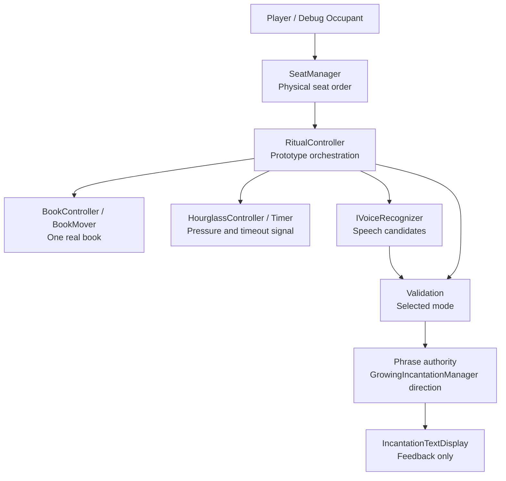

# Technical Architecture

This document defines current technical ownership and architecture boundaries.

Purpose: help contributors change systems without moving authority into the wrong place.

Questions answered here:

- Which systems own gameplay authority?
- Which objects are visual-only?
- What is the current runtime migration state?
- What boundaries must architecture changes preserve?

This document does not contain gameplay law, current task planning, historical milestone memory, or complete code-level reference.

Read next: `Docs/PROJECT_KNOWLEDGE.md` for the detailed code map, or a focused system document for the system being changed.

## Current Priority

Priority 1 is the clean core ritual loop and reliable voice interaction.

The current prototype is a local playable ritual slice. Lobby is the next major milestone. The FishNet connection foundation and permanent NetworkPlayer data boundary exist, but gameplay networking is not implemented.

## Architecture Boundaries

- Prefer extending existing systems over creating new ones.
- Keep gameplay logic out of visual-only objects.
- Keep the Seat system logical and the chair visual.
- `SeatManager` owns the configured physical seating order around the table.
- Keep `BookGhost` as a visual placement reference only.
- Keep one real gameplay book.
- Keep `SpellPhraseLibrary` separate from ritual words.
- Treat `WhisperSandbox` as sandbox/reference code unless explicitly asked to change it.
- Do not make characters walk around.

## Current Prototype Systems

### Lobby Player State

`NetworkPlayer` is the permanent per-connection source of player identity and shared player state. FishNet supplies its `Connection`, `Owner`, and local ownership status. The component replicates high-priest role, priest name, lobby lifecycle state, ready state, and Seat ID; it exposes change events and server-only mutation APIs. Character customization ID remains an unsynchronized data boundary until its focused networking task.

`NetworkPlayer.SeatId` is the single authoritative multiplayer Seat assignment. Owners submit
Seat requests to the server; the server rejects an ID already assigned to another active
player and replicates accepted changes. `SeatManager` derives stable zero-based IDs from the
configured clockwise physical Seat list, resolves a Seat occupant through active
`NetworkPlayer` instances, and refreshes existing local presentation. `Seat.currentPlayer`
and `Seat.isOccupied` remain only as backward-compatible offline/debug presentation state.
They must not be used as a second network occupancy authority.

`LobbyPlayerStateController` temporarily remains the local lobby transition authority used by the current Living Book flow. It is not a second permanent player model and must be adapted to read/write `NetworkPlayer` in a later lobby-networking task. `NetworkPlayer` does not render UI, select a Seat, move the Book, control a character, or run ritual gameplay.

The current v0.1 prototype includes:

- `RitualController` as the current prototype ritual orchestration surface.
- `SeatManager` for physical seat traversal and book routing.
- `BookMover` and book helpers for moving the one real book.
- `IncantationManager` and core ritual phrase systems for phrase state and word acceptance.
- `VoicePhraseNormalizer` for phrase and word normalization.
- `WindowsKeywordVoiceRecognizer` for realtime keyword recognition.
- `WhisperVoiceRecognizer` for Whisper-based recognition paths.
- `HourglassController` for timer pressure.
- Lighting and ambience components for fire flicker, hourglass light possession, room veil, and cabin atmosphere.

For a visual overview of ownership, dependencies, events, and extension points, read `Docs/SYSTEM_DIAGRAM.md`.

## High-Level System Diagram

## Runtime Migration State

The project is in an incremental migration, not a completed rewrite.

`RitualController` is still the working prototype runtime surface. It coordinates seats, book movement, hourglass timing, voice listening, incantation display, validation mode handling, retry behavior, and successful turn advancement.

`CoreRitualLoop` is the cleaner logic direction. It coordinates `TurnManager`, `GrowingIncantationManager`, and `PhraseValidator`, but it does not know about scene visuals, the book transform, the hourglass, voice recognizer implementations, networking, or UI.

`CoreRitualLoopBridge` adapts the newer core phrase path into the legacy `IncantationManager` model while UI and feedback still depend on it.

Do not assume newer core-loop scripts have replaced the current prototype runtime. Prefer incremental migration that keeps Play Mode working.

For a detailed code map and known migration tensions, read `Docs/PROJECT_KNOWLEDGE.md`.

## Physical Seat Order

The cursed book advances according to the configured physical seating order, not according to GameObject names, seat numbers, hierarchy order, player join order, or network player index.

The Core Ritual Engine must never assume sequential numbering.

The current prototype clockwise order is:

1. Seat1
2. Seat5
3. Seat3
4. Seat6
5. Seat2
6. Seat7
7. Seat4
8. Seat8

Counter-clockwise traversal is the exact reverse.

Traversal rules may later be temporarily changed by spell-card effects such as reverse rotation, random next player, skip occupied seat, or double jump. Those effects modify traversal behavior; they do not move ownership of physical order out of the Seat system.

Debug occupants are for local testing only and should be replaced by lobby and networking flow later.

## Voice Architecture

The project currently supports two validation modes:

- `WordByWordRealtime`: default prototype mode using immediate keyword recognition for visible word-by-word acceptance.
- `FullPhrase`: optional strict mode using full phrase transcript validation.

`WindowsKeywordVoiceRecognizer` is currently preferred for realtime prototype gameplay.

Whisper remains available for full-phrase or experimental recognition paths and should not be removed, but it should not be forced as the only validation path.

Unity Dictation and Azure are not part of the current project plan.

## Phrase Ownership

The ritual phrase:

- Starts with 1 word.
- Is shared by all active players.
- Grows by 1 word after a full active table rotation.
- Does not grow after each individual player.
- Does not fork per player.
- Must remain separate from `SpellPhraseLibrary`.

## Paused Systems

Notebook, cards, lore, demon reactions, campaign objectives, assets, scenes, prefabs, and networking should not be changed during core ritual tasks unless explicitly requested.
